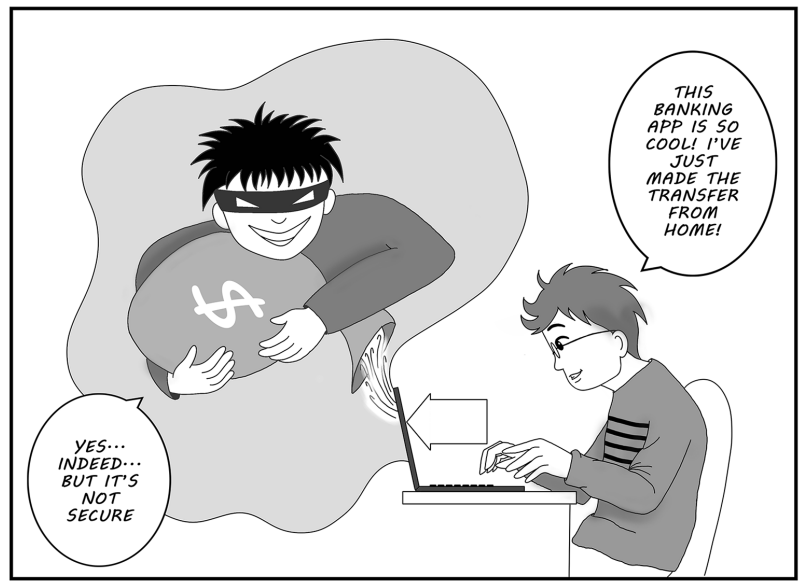
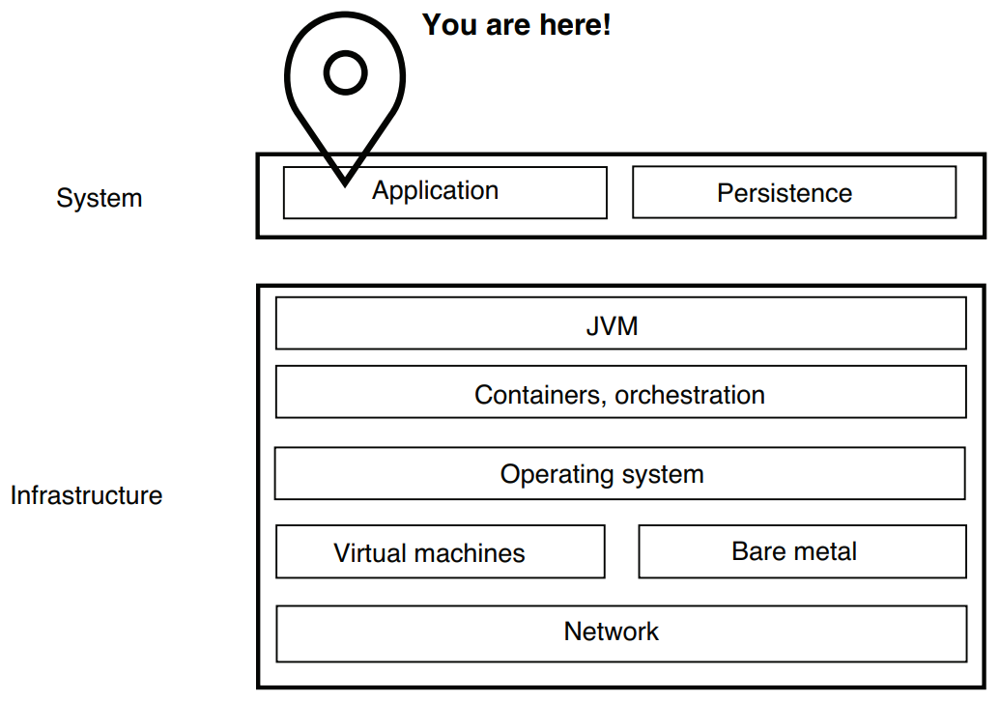
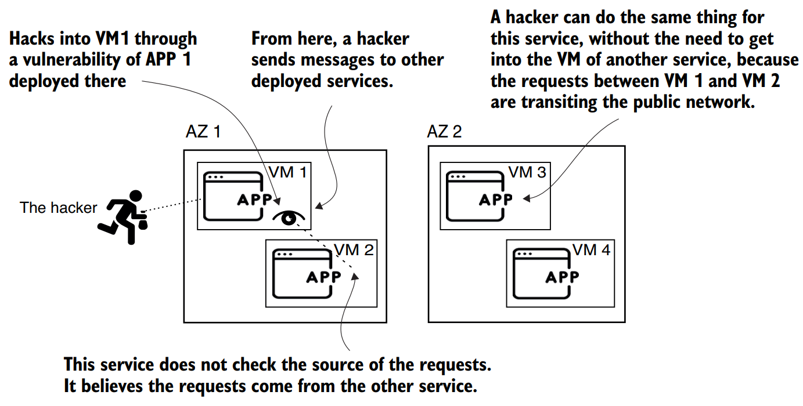

# Chapter 1 — Security Today
### Revision Notes

---

## 1. The Big Picture: Why Does Software Security Matter?

Developers usually learn that an app exists to solve business problems: process data, persist it, and display it as the requirements say. This view hides other parts of the job. An app can work perfectly for the user and still have hidden weaknesses. This is the opening chapter of Part 1 ("Say hello to Spring Security"), which sets the "why" before the hands-on "how" of chapter 2 (first project, architecture, overriding default configurations, custom user details, endpoint authorization, configuration styles, custom authentication logic, multiple configuration classes).

**This chapter covers:**
- What Spring Security is and what you can solve with it
- What security is for a software application
- Why software security is essential and why you should care

**Nonfunctional qualities:**
- Examples: performance, scalability, availability, security.
- Their effect shows over time (short to long term).
- Ignoring them early can dramatically hurt the **profitability** of the app owners.
- Neglect can also cause failures in *other* systems (e.g., unwilling participation in a **DDoS** attack).
- They are **hidden**: it is much harder to notice something missing or incomplete than a broken feature, which makes them more dangerous.
- All nonfunctional aspects matter; this book focuses on **security**, protecting the app step by step with Spring Security.

*(Users focus on functional aspects; security measures usually go unnoticed.)*

**Key definition:**
> A **nonfunctional requirement** is a quality of the system (performance, scalability, availability, security) rather than something the user directly sees it *do*.

> **NOTE** — This chapter gives the big picture of security concepts. Later chapters refer back to it, add details where needed, and point to further reading (books, articles, docs).

---

## 2. Discovering Spring Security

### 2.1 What it is

- Official description: a **powerful and highly customizable framework for authentication and access control**.
- Author's version: a framework that greatly simplifies applying ("baking in") security for Spring applications.
- The **primary choice** for **application-level security** in Spring apps.
- Purpose: a highly customizable way to implement **authentication**, **authorization**, and **protection against common attacks**.
- Open source, **Apache 2.0** licence; source on GitHub (http://mng.bz/vPmJ). Contributing is encouraged.

> **NOTE** — Spring Security works for standard web servlets, reactive apps, and non-web apps. The book uses Java 21, Spring 6, and Spring Boot 3 (latest LTS Java). All examples also work with Java 17 (previous LTS).

### ⚠️ Important: It is not magic

- Spring Security does **not** automatically secure your app and does **not** guarantee a vulnerability-free app.
- Developers must understand how to **configure and customize** it for their app's needs.
- How depends on many factors, from functional requirements to architecture.

### 2.2 The Spring way of applying security

- Spring philosophy starts with the **Spring context**: define beans, and the framework manages them based on your configuration.
- Annotations tell Spring what to do (expose endpoints, wrap methods in transactions, intercept methods with aspects, …).
- Spring Security follows the same style: annotations, beans, and Spring-fashioned configuration.
- In a Spring app, the behavior you need to protect is defined by **methods**.

**Analogy — your home:**
- Do you hide the key under the rug? Do you even have a key for the front door?
- Security is a puzzle with many choices: leave the house unsecured, restrict who enters, or add alarm systems, cameras, and locks.
- More complexity = more cost. In applications, the cost is the effect on **maintainability and performance**.

### 2.3 What Spring Security components do

**Access decisions (most common use case)**
- Decide whether someone may perform an action or use some data.
- You write components that **intercept requests** and ensure the caller has permission for the protected resource.
- The developer configures them to do exactly what is desired.
- Alarm analogy: if you forget to set the alarm for the windows, it's not the alarm system's fault when it doesn't trigger on a forced window.

**Data storage**
- Components intercept calls and can apply **encryption** or **hashing** so data stays accessible only to privileged entities.
- The developer must **add and configure** the component wherever needed.
- Spring Security provides a **contract**: it tells you what to implement, and you write the implementation to fit your design.

**Data in transit**
- Two communicating components may not trust each other: how does the first know the second really sent a message?
- Analogy: on a phone call where you must share private info, how do you know the right person is on the other end?
- Spring Security provides components to solve this in several ways; you must know which part to configure. It intercepts messages and validates communication before the app uses any data sent or received.

**Less code**
- Like Spring itself, it lets you write **less code** for a critical concern (security).
- Provides predefined functionality (no boilerplate, no repeating logic from app to app) while remaining configurable.

**Recap**
- You use Spring Security to bake app-level security in *the Spring way* (annotations, beans, **SpEL**, etc.).
- It lets you *build* application-level security; **you** must understand and use it properly. It doesn't secure data at rest or in flight by itself.
- This book gives you what you need to use it effectively.

---

## 3. Alternatives to Spring Security

The author's advice: always learn the alternatives; "everything is relative", so there is no general right or wrong.

| Option | Recommended? | Notes |
|---|---|---|
| Spring Security | ✅ | De facto choice for Spring apps; a whole set of tools, not just a hammer; built for Spring; larger, active community; continuously enhanced |
| Apache Shiro (https://shiro.apache.org) | ⚠️ | Few real alternatives exist; Shiro is the main one. May be too light for some apps |

**Apache Shiro:**
- Flexible configuration; easy to integrate with Spring and Spring Boot.
- Easy to learn if you already know Spring Security.
- Has its own annotations and a design for web apps based on **HTTP filters**.
- Secures more than web apps: command-line, mobile, and large enterprise apps.
- Simple but powerful: authentication, authorization, cryptography, session management.

---

## 4. What Is Software Security?

### 4.1 Definition

- Software manages large amounts of data; a significant part is **sensitive** (especially given regulations such as **GDPR**).
- Sensitive data = anything a user considers private. It can be harmless-looking (phone number, email, ID number) or riskier (credit card details).
- The app must ensure that information cannot be **accessed, changed, or intercepted**, and that no party other than the intended users can interact with it in any way. Broadly, this is the meaning of security.

> **NOTE** — GDPR made a lot of buzz after its introduction in 2018. It is a set of European laws on data protection that gives people more control over their private data. It applies to owners of systems that have users in Europe, who risk significant penalties for non-compliance.

### 4.2 Security in layers

- Security is applied in **layers**, each needing a different approach.
- **Castle analogy:** a hacker must bypass several obstacles to reach the app's resources. The better each layer is secured, the lower the chance of unauthorized access or operations.

*(Dark Wizard/hacker must bypass multiple layers to steal the Magic Sword/user resources from the Princess/your application.)*

- Security is not only at the application level: networking, storage, and deployment each have their own problems and practices.
- **Spring Security belongs to application-level security.**

### 4.3 Application-level security

- Everything an app should do to protect the **environment it runs in** and the **data it processes and stores**.
- It isn't only about the app's own data: a vulnerable app can let an attacker affect the **entire system**.

*(Security is hierarchical: infrastructure, system, application, persistence, network layers; this book targets the top application layer.)*

### 4.4 Practical case: two services, two availability zones

- Typical of **microservices** deployed across multiple cloud availability zones.
- **Best practice:** when securing one layer, assume as much as possible that the layer above **doesn't exist** (castle: train the 30 soldiers to be as strong as possible even though someone must first cross the fiery bridge).

*(Attacker gains control of one VM, then other apps; across two AZs, messages can be intercepted on the public network.)*

**Scenario A: attacker gets into VM 1**
- Attacker logs in to the VM hosting the first app.
- The second app **doesn't validate requests** from the first.
- Attacker exploits this and **impersonates** the first app to control the second.

**Scenario B: services in different locations**
- The attacker doesn't need to log in to any VM.
- They can act directly **in the middle of communications** between the two apps.

> **NOTE** — An **availability zone (AZ)** is a separate data center, far enough geographically (and with other dependencies) from others in the same region that if one fails, the probability others fail is minimal. Security-wise, traffic between two data centers usually needs special attention because it often crosses a **public network**.

### 4.5 Authentication and authorization

| Term | Meaning |
|---|---|
| **Authentication** | The app **identifies** a user (a person or another application) |
| **Authorization** | Deciding **what the identified user is allowed to do** |

- Details start in **book chapter 3** and continue throughout the book.
- Most apps restrict certain functionality: first identify who requests it (authentication), then check their privileges (authorization).
- Complexity grows with the system, and different situations need specific implementations.

**Example problem — delegated access:**
- A **printer** needs to read the user's documents.
- Sharing the user's credentials gives the printer **more rights than needed** and **exposes the credentials**.
- Is there a way to do this without impersonating the user? These are the kinds of questions answered with Spring Security in the book.

**Where it applies:**
- Authentication/authorization exist at the level of the whole system and for each component.
- With Spring Security you sometimes authorize even at different **tiers of the same component**: **method security** (book chapter 11).
- Design gets more complicated with a predefined set of **roles and authorities**.

### 4.6 Data storage

- Data at rest adds responsibility: the app shouldn't store all data in **readable** format.
- Data is sometimes kept **encrypted** (with a private key) or **hashed**.
- Secrets (credentials, private keys) are data at rest too; store them carefully, usually in a **secrets vault**.

> **NOTE** — Data is classified as **at rest** (in computer storage, i.e., persisted) or **in transition** (exchanged from one point to another). Different security measures apply to each type.

### 4.7 Application memory

- Data in the app's **heap** can also be a vulnerability.
- Class design may keep sensitive data (credentials, private keys) in memory for a long time.
- Someone with the privilege to make a **heap dump** could find these and misuse them.

### 4.8 Wrap-up

- Software security is a **tangled subject**; an expert must understand, apply, and test solutions for *all* layers.
- This book focuses only on what you need for **Spring Security**: where it applies and where it doesn't, how it helps, and why to use it, with practical examples adaptable to your own use cases.

---

## 5. Why Is Security Important?

### 5.1 Think as a user

- Apps have access to your data: they can **change, use, or expose** it (email, online banking, …).
- Data and actions differ in sensitivity: you may not care if someone reads some of your emails, but you'd care if someone emptied your bank account.
- Then take an **objective** view: the same data or action may be more sensitive to other people.
- The app must protect everything to the **desired degree of access**.
- Any leak that allows use of data/functionality, or that lets the app affect other systems, is a **vulnerability** and must be fixed.

### 5.2 The cost of insufficient security

- Generally it's about **money**, but there are many ways to lose profitability: not only stolen money or unpaid service use.
- **Brand/company image** is valuable, and losing it can cost even more than the direct expenses of an exploit.
- **User trust** is one of an app's most valuable assets and can decide success or failure.

### 5.3 Fictitious examples

| Scenario | Likely impact |
|---|---|
| Back-office app leaks internal organization data | Organization and its employees affected; company may be **liable** and lose significant money; users can't change the app, but the organization may **change the software provider** |
| Ride-sharing users see money debited for trips that aren't theirs | Users likely **switch provider**; **image** damage is far bigger than the money cost; even with refunds, customers are lost → hurts profitability, may lead to **bankruptcy** |
| Mobile banking users see other users' transactions after an update | Dramatic loss of **trust** and **legal repercussions** |

**Possible root causes (small weaknesses):**
- Example 1: broken authentication or **CSRF** (cross-site request forgery).
- Examples 2 and 3: **lack of method access control**.
- Any example: a **combination** of vulnerabilities.

### ⚠️ Important: Higher stakes

- In defense-related systems, healthcare, or nuclear power control, add **human lives** to the cost.
- Reduce risk by **investing early** in security and giving security professionals enough time to develop and test the mechanisms.

> **NOTE** — Lesson from those who failed before you: the cost of an attack is usually higher than the investment cost of avoiding the vulnerability.

- Book will show how to apply Spring Security to avoid such situations.
- If you must compromise on security, **estimate your risks correctly**.

---

## 6. What Will You Learn in This Book?

**Approach and prerequisites:**
- Practical approach: deep dives into Spring Security through simple-to-complex examples.
- You should be comfortable with **Java** and the **basics of the Spring Framework**.
- If not, the author recommends (in order):
  - *Spring Start Here* by the author (Manning, 2021)
  - *Spring in Action, Sixth Edition* by Craig Walls (Manning, 2022)
  - *Spring Boot: Up and Running* by Mark Heckler (O'Reilly, 2021)
- Related reading: *Cloud Native Spring in Action* by Thomas Vitale (Manning, 2022), for efficient cloud-oriented Spring apps.

**You'll learn:**
- The **architecture and basic components** of Spring Security and how to use it to secure your app
- **Authentication and authorization**, including **OAuth 2** and **OpenID Connect** flows, and how they apply to a production-ready app
- How to implement security in **different layers** of your app
- Different **configuration styles** and best practices for using them
- Using Spring Security for **reactive applications**
- **Testing** your security implementations

The author strongly recommends working through all the accompanying examples.

---

## 7. Summary of All Approaches

This chapter introduces no code-level approaches; the table below collects its conceptual "tools and levels" and the choice of framework.

| Approach | Syntax / Tool | When to use |
|---|---|---|
| Application-level security in Spring apps | Spring Security (annotations, beans, SpEL) | Default choice for Spring apps; authentication, authorization, protection against common attacks |
| Lightweight alternative | Apache Shiro | Simpler needs; web, CLI, mobile, or enterprise apps; HTTP filter-based design |
| Encrypt or hash persisted data | Encryption (private key) / hashing | Data at rest |
| Store secrets | Secrets vault | Credentials, private keys |
| Validate inter-service requests | Application-level authentication between services | Microservices, especially across AZs / public networks |
| Fine-grained authorization | Method security (book chapter 11) | Authorization at different tiers of a component |

**Chapter summary points:**
- Spring Security is the leading choice for securing Spring applications, offering many alternatives for different styles and architectures.
- Apply security in **layers**; each layer needs different practices.
- Security is a **cross-cutting concern**; consider it from the **beginning** of a project.
- The cost of an attack is usually higher than the cost of preventing vulnerabilities.
- The smallest mistakes can cause significant harm, e.g., exposing sensitive data through **logs or error messages** is a common way to introduce vulnerabilities.

---

## Quick-Reference Summary

| Concept | One-liner |
|---|---|
| Spring Security | Powerful, highly customizable framework for authentication and access control in Spring apps (Apache 2.0) |
| Application-level security | Everything an app must do to protect its environment and the data it processes and stores |
| Nonfunctional requirements | Performance, scalability, availability, security: easy to overlook, costly if ignored |
| Authentication | Identifying a user (person or application) |
| Authorization | Deciding what an identified user is allowed to do |
| Security in layers | Castle model: each layer is secured as if the layer above didn't exist |
| Data at rest | Persisted data; protect via encryption/hashing; keep secrets in a vault |
| Data in transition | Data exchanged between points; validate the communicating parties |
| Heap exposure | Sensitive data kept long in memory can be found via heap dump |
| Availability zone (AZ) | Separate data center; traffic between AZs often crosses a public network |
| GDPR | European data-protection laws (2018); penalties for owners of systems with European users |
| Apache Shiro | Lighter alternative to Spring Security, based on HTTP filters and its own annotations |
| DDoS / CSRF | Example attack types: neglected security can make you an unwilling DDoS participant; CSRF can lead to data leaks |
| Method security | Authorization on methods/tiers of a component (book chapter 11) |

---
