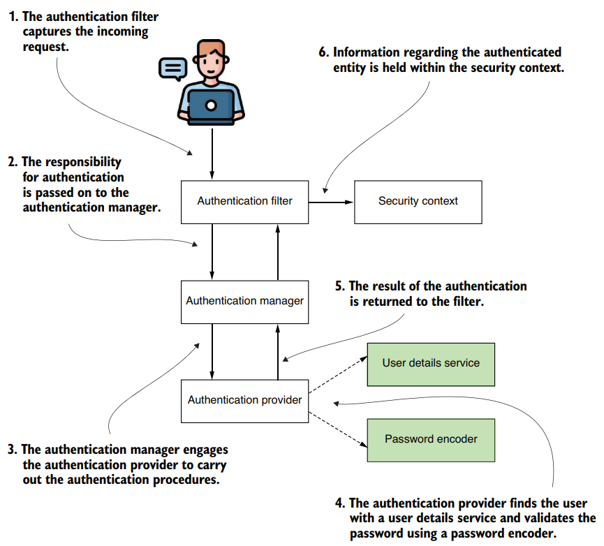
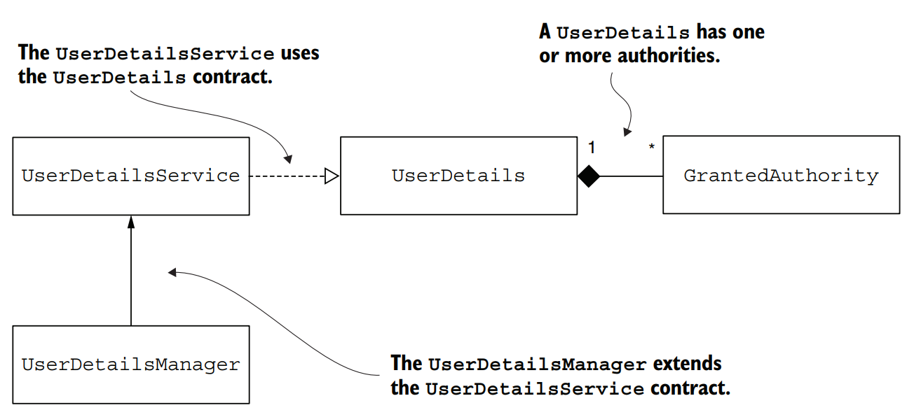
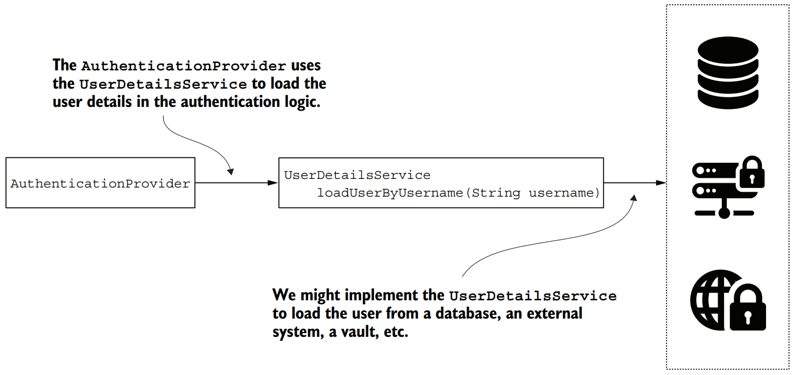
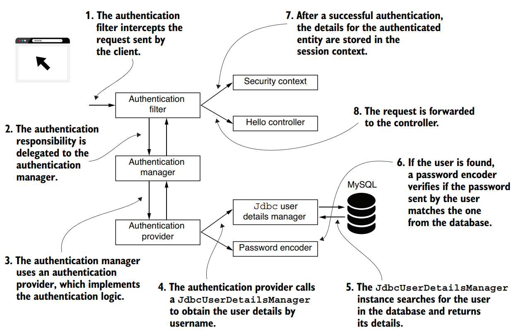

# Chapter 3 — Managing Users
### Revision Notes

---

## 1. The Big Picture: How Does Spring Security Understand and Manage Users?

Frameworks use **contracts** (Java interfaces) to decouple their own implementations from the application built on top. A programmer is like a chef: you don't memorize every recipe, you learn how the basic ingredients (contracts) fit together, then pick the right implementation. This chapter digs into the `UserDetailsService` role first met in the chapter 2 example, together with the related contracts.

*(Part 2 roadmap: ch. 3 user management → ch. 4 password encoding/Crypto → ch. 5 filters → ch. 6 `AuthenticationProvider`, HTTP Basic and form login.)*

**This chapter covers:**
- Describing a user with the `UserDetails` interface
- Using the `UserDetailsService` in the authentication flow
- Creating a custom implementation of `UserDetailsService`
- Creating a custom implementation of `UserDetailsManager`
- Using `JdbcUserDetailsManager` in the authentication flow

**Contracts discussed:**

| Contract | Role |
|---|---|
| `UserDetails` | Describes the user for Spring Security |
| `GrantedAuthority` | Defines an action (privilege) the user can execute |
| `UserDetailsService` | Retrieves a user by username |
| `UserDetailsManager` | Extends `UserDetailsService`; adds create / modify / delete user and change password |

**Also covered:**
- The implementations Spring Security provides and how to use them (`InMemoryUserDetailsManager`, `JdbcUserDetailsManager`, `LdapUserDetailsManager`)
- How and when to write a custom implementation
- Ways these interfaces are implemented in real-world apps
- Best practices for using them

**Plan:** how Spring Security sees a user (`UserDetails`, `GrantedAuthority`) → `UserDetailsService` → `UserDetailsManager` → provided implementations → custom implementation when those don't fit.

### 1.1 Implementing authentication in Spring Security

Chapter 2 only scratched the surface of the Boot defaults. Here (and in chapters 4 and 5) the interfaces are covered in detail. This architecture is the backbone of authentication and appears in almost every chapter, so you'll probably learn it by heart. Knowing it is like being a chef who knows their ingredients.


*(Spring Security's authentication flow: filter → manager → provider, which uses a UserDetailsService and PasswordEncoder; the result goes to the security context.)*

**Flow (6 steps):**
1. The authentication filter captures the incoming request.
2. Responsibility for authentication passes to the authentication manager.
3. The manager engages the authentication provider.
4. The provider finds the user with a user details service and validates the password with a password encoder.
5. The result is returned to the filter.
6. Information about the authenticated entity is held in the security context.

- The **shaded boxes** (`UserDetailsService` + `PasswordEncoder`) are the "**user management part**" of the flow.
- They deal directly with user details and credentials.
- `PasswordEncoder` is detailed in chapter 4.

**Interface segregation principle in action:**
- `UserDetailsService` only **retrieves a user by username**, which is the only thing the framework needs to authenticate.
- `UserDetailsManager` adds **add / modify / delete** behavior, needed by most apps but not forced on you.
- If the app only authenticates users, implementing `UserDetailsService` is enough.
- Both need a way to represent a user → the `UserDetails` contract.
- A user has privileges = actions they may do → `GrantedAuthority` ("authorities"). A user has one or more. Used heavily in authorization, chapters 7–12.


*(Dependencies in user management: UserDetailsService uses UserDetails; UserDetailsManager extends UserDetailsService; one UserDetails has 1..* GrantedAuthority.)*

**Key definition:**
> `UserDetails` is the contract that represents a user as Spring Security understands it; your user class must implement it.

---

## 2. Describing the User

Learning to represent users so the framework understands them is an essential step in building the authentication flow. The app decides (e.g., whether a call to some functionality is allowed) based on the user. To define the user prototype in your app, it must fulfill the **`UserDetails` contract**.

### 2.1 Describing Users with the `UserDetails` Contract

```java
public interface UserDetails extends Serializable {
    String getUsername();                                          // ← credentials
    String getPassword();                                          // ← credentials
    Collection<? extends GrantedAuthority> getAuthorities();       // ← actions the user may do
    boolean isAccountNonExpired();                                 // ← these four enable/disable
    boolean isAccountNonLocked();                                  //   the account for different
    boolean isCredentialsNonExpired();                             //   reasons
    boolean isEnabled();
}
```

**Method groups:**

| Methods | Purpose |
|---|---|
| `getUsername()`, `getPassword()` | Return the credentials. The **only** authentication-related details in the contract |
| `getAuthorities()` | Returns the actions the app allows the user, as a collection of `GrantedAuthority` |
| `isAccountNonExpired()`, `isAccountNonLocked()`, `isCredentialsNonExpired()`, `isEnabled()` | Enable/disable the account (the book relates these five non-credential methods to authorizing access) |

- An *authority* = a privilege the user has (e.g., read, write, delete data).
- A user can: let the account **expire**, **lock** the account, let credentials **expire**, or **disable** the account.
- To implement such restrictions, implement the four methods so that a usable account returns `true`.
- If your app has no such restrictions, just **return `true`** from all four.

> **NOTE** — Chapter 6 shows that Spring Security uses "authorities" for either fine-grained privileges or *roles* (groups of privileges). In this book, fine-grained privileges are called **authorities**.

> **NOTE** — The last four method names look odd (`isAccountNonExpired()` reads like a double negation) and arguably hurt clean code. But they're deliberately named so that **`false` means authorization should fail and `true` means OK**, since people associate "true" with positive scenarios and "false" with negative.

### 2.2 The `GrantedAuthority` Contract

- Authorities = what the user can do. Without them all users would be equal.
- Most apps have different user kinds (read-only vs. can modify data) and must differentiate between them. Authorization rules (chapters 7–12) are written on these authorities.
- A user must have **at least one** authority.
- To create an authority you only need a **name** for the privilege, used later in authorization rules.

```java
public interface GrantedAuthority extends Serializable {
    String getAuthority();
}
```

- Only **one abstract method** → can be implemented with a **lambda** (used often in the book).
- Alternative: `SimpleGrantedAuthority` creates **immutable** `GrantedAuthority` instances; you give the name when building it.

```java
GrantedAuthority g1 = () -> "READ";                          // ← lambda
GrantedAuthority g2 = new SimpleGrantedAuthority("READ");    // ← SimpleGrantedAuthority
```

### 2.3 Writing a Minimal Implementation of `UserDetails`

Start with a basic version where each method returns a static value, then move to a version that supports multiple users. `DummyUser` always represents one user: **"bill"**, password **"12345"**, authority **"READ"**.

**Listing 3.2 – The `DummyUser` class**
```java
public class DummyUser implements UserDetails {
    @Override
    public String getUsername() {
        return "bill";
    }
    @Override
    public String getPassword() {
        return "12345";
    }
    // Omitted code
}
```

**Listing 3.3 – `getAuthorities()`** (collection with one `GrantedAuthority`)
```java
public class DummyUser implements UserDetails {
    // Omitted code
    @Override
    public Collection<? extends GrantedAuthority> getAuthorities() {
        return List.of(() -> "READ");
    }
    // Omitted code
}
```

**Listing 3.4 – The last four methods** (always `true` → user forever active and usable)
```java
public class DummyUser implements UserDetails {
    // Omitted code
    @Override
    public boolean isAccountNonExpired() {
        return true;
    }
    @Override
    public boolean isAccountNonLocked() {
        return true;
    }
    @Override
    public boolean isCredentialsNonExpired() {
        return true;
    }
    @Override
    public boolean isEnabled() {
        return true;
    }
    // Omitted code
}
```

⚠️ **Not for real apps:** all instances of `DummyUser` are the same user. For a real app, make a class that produces instances for *different* users, with at least username and password as attributes:

**Listing 3.5 – A more practical implementation (`SimpleUser`)**
```java
public class SimpleUser implements UserDetails {
    private final String username;
    private final String password;

    public SimpleUser(String username, String password) {
        this.username = username;
        this.password = password;
    }
    @Override
    public String getUsername() {
        return this.username;
    }
    @Override
    public String getPassword() {
        return this.password;
    }
    // Omitted code
}
```

### 2.4 Using a Builder to Create `UserDetails` Instances

For simple apps you may not need a custom `UserDetails` class. The **`User`** class (package `org.springframework.security.core.userdetails`) builds **immutable** `UserDetails` instances.
- You must provide at least a **username** and a **password**; the username can't be an empty string.
- No custom implementation of the contract is needed.

**Listing 3.6 – Constructing a user with the `User` builder**
```java
UserDetails u = User.withUsername("bill")
    .password("12345")
    .authorities("read", "write")
    .accountExpired(false)
    .disabled(true)
    .build();
```

**Anatomy of the builder:**
- `User.withUsername(String username)` returns a `UserBuilder` (nested in `User`).
- Another way to get a builder: start from an **existing `UserDetails`** instance.
- `build()` (end of the pipeline) applies the password-encoding function (if one was given), constructs the `UserDetails`, and returns it.

**Listing 3.7 – Creating the `User.UserBuilder` instance**
```java
User.UserBuilder builder1 = User.withUsername("bill");        // ← builds from a username string
UserDetails u1 = builder1
    .password("12345")
    .authorities("read", "write")
    .passwordEncoder(p -> encode(p))                          // ← encoder is only a function
    .accountExpired(false)
    .disabled(true)
    .build();                                                 // ← end of the build pipeline

User.UserBuilder builder2 = User.withUserDetails(u);          // ← builds from an existing UserDetails
UserDetails u2 = builder2.build();
```

> **NOTE** — In the listing `encode(...)` is not defined and `u` in `withUserDetails(u)` is not declared in this snippet (it presumably refers to a `UserDetails` instance from earlier); the book shows them as-is.

> **NOTE** — The password encoder here is a `Function<String, String>`, **not** Spring Security's `PasswordEncoder` interface. Its only job is to transform a password into a given encoding. The `PasswordEncoder` contract (used in chapter 2) is covered in detail in chapter 4.

### 2.5 Combining Multiple Responsibilities Related to the User

Real apps are more complicated: a user relates to several responsibilities.
- Users stored in a DB → also need a **persistence entity** class.
- Users fetched via a web service from another system → probably need a **DTO**.

Example (simple, typical case): SQL table of users, one authority per user, mapped by a JPA entity.

**Listing 3.8 – JPA `User` entity**
```java
@Entity
public class User {
    @Id
    private Long id;
    private String username;
    private String password;
    private String authority;
    // Omitted getters and setters
}
```

❌ **Avoid: one class with two responsibilities.** If the same class also implements `UserDetails`, it gets messy (the author: "it is a mess. I would get lost in it").

**Listing 3.9 – The `User` class has two responsibilities**
```java
@Entity
public class User implements UserDetails {
    @Id
    private int id;
    private String username;
    private String password;
    private String authority;

    @Override
    public String getUsername() {
        return this.username;
    }
    @Override
    public String getPassword() {
        return this.password;
    }
    public String getAuthority() {
        return this.authority;
    }
    @Override
    public Collection<? extends GrantedAuthority> getAuthorities() {
        return List.of(() -> authority);
    }
    // Omitted code
}
```

**Why it's confusing:**
- Mixes JPA annotations, getters/setters, and contract overrides.
- `getUsername()` / `getPassword()` override the contract methods.
- `getAuthority()` (returns a `String`) is just a getter, while `getAuthorities()` (returns a `Collection`) implements the interface.
- It gets worse once you add relationships to other entities.

✅ **Recommended: separate the two responsibilities.** Root cause = mixing two responsibilities. Create a separate **`SecurityUser`** that *adapts* `User` and implements `UserDetails`. `User` keeps only its JPA role.

**Listing 3.10 – `User` as only a JPA entity**
```java
@Entity
public class User {
    @Id
    private int id;
    private String username;
    private String password;
    private String authority;
    // Omitted getters and setters
}
```
- Now you can focus only on persistence details, which don't matter from the Spring Security perspective.

**Listing 3.11 – `SecurityUser` implements the `UserDetails` contract**
```java
public class SecurityUser implements UserDetails {
    private final User user;                                  // ← wraps the entity; final = makes no sense without a User

    public SecurityUser(User user) {
        this.user = user;                                     // ← user must be given via constructor
    }
    @Override
    public String getUsername() {
        return user.getUsername();
    }
    @Override
    public String getPassword() {
        return user.getPassword();
    }
    @Override
    public Collection<? extends GrantedAuthority> getAuthorities() {
        return List.of(() -> user.getAuthority());
    }
    // Omitted code
}
```
- `SecurityUser` only maps the system's user details to the `UserDetails` contract.
- It adds the Spring Security code without mixing it into the JPA entity.

> **NOTE** — There are different ways to separate the two responsibilities; this is not claimed to be the best or only one, and the choice varies per case. The main idea: **avoid mixing responsibilities and decouple your code** for maintainability.

---

## 3. Instructing Spring Security on How to Manage Users

The previous section described users. Now: how does Spring Security *manage* them?
- Where are users taken from when comparing credentials?
- How do you add new users or change existing ones?

From chapter 2: the authentication process delegates user management to the **`UserDetailsService`** instance (we even defined our own to override the Boot default).

**What this section does:**
1. Experiments with implementing `UserDetailsService`.
2. Shows how `UserDetailsManager` adds behavior.
3. Uses Spring Security's provided `UserDetailsManager` implementations, with an example project using the well-known `JdbcUserDetailsManager`.

Outcome: you know how to tell Spring Security **where to find users**, which is essential in the authentication flow.

### 3.1 Understanding the `UserDetailsService` Contract

```java
public interface UserDetailsService {
    UserDetails loadUserByUsername(String username)
        throws UsernameNotFoundException;
}
```

- The authentication implementation calls `loadUserByUsername(String username)` to get a user's details.
- The username is considered **unique**.
- Returns a `UserDetails` implementation; if the username doesn't exist → throws `UsernameNotFoundException`.


*(The AuthenticationProvider calls loadUserByUsername on the UserDetailsService, which may load users from a database, external system, vault, etc.)*

> **NOTE** — `UsernameNotFoundException` is a `RuntimeException`. The `throws` clause in the interface is **documentation only**. It inherits directly from `AuthenticationException` (parent of all authentication-related exceptions), which in turn inherits `RuntimeException`.

### 3.2 Implementing the `UserDetailsService` Contract

Your app may hold credentials/user data in a DB or another system reached through a web service or other means. Regardless, Spring Security only needs **an implementation that retrieves the user by username**.

**Project `ssia-ch3-ex1`:** a `UserDetailsService` with an **in-memory list** of users. It mirrors what `InMemoryUserDetailsManager` did in chapter 2, but implemented by hand. The list is supplied when creating the service instance. `UserDetails` goes in package `model`; the service in package `services`.

**Listing 3.12 – The `UserDetails` implementation**
```java
public class User implements UserDetails {
    private final String username;       // ← immutable: three attributes given at build time, can't change
    private final String password;
    private final String authority;      // ← simplicity: one authority per user

    public User(String username, String password, String authority) {
        this.username = username;
        this.password = password;
        this.authority = authority;
    }

    @Override
    public Collection<? extends GrantedAuthority> getAuthorities() {
        return List.of(() -> authority);  // ← list with only the GrantedAuthority named when the instance was built
    }
    @Override
    public String getPassword() {
        return password;
    }
    @Override
    public String getUsername() {
        return username;
    }
    @Override
    public boolean isAccountNonExpired() {   // ← account does not expire or get locked
        return true;
    }
    @Override
    public boolean isAccountNonLocked() {
        return true;
    }
    @Override
    public boolean isCredentialsNonExpired() {
        return true;
    }
    @Override
    public boolean isEnabled() {
        return true;
    }
}
```

**Listing 3.13 – The `UserDetailsService` implementation** (package `services`)
```java
public class InMemoryUserDetailsService implements UserDetailsService {
    private final List<UserDetails> users;    // ← manages the list of users in memory

    public InMemoryUserDetailsService(List<UserDetails> users) {
        this.users = users;
    }

    @Override
    public UserDetails loadUserByUsername(String username)
        throws UsernameNotFoundException {
        return users.stream()
            .filter(
                u -> u.getUsername().equals(username)
            )
            .findFirst()                       // ← if such a user exists, return it
            .orElseThrow(                      // ← otherwise throw an exception
                () -> new UsernameNotFoundException("User not found")
            );
    }
}
```
- `loadUserByUsername` searches the list for the username and returns the `UserDetails`; if none matches → `UsernameNotFoundException`.

**Listing 3.14 – Registered as a bean in the configuration class** (with one user)
```java
@Configuration
public class ProjectConfig {
    @Bean
    public UserDetailsService userDetailsService() {
        UserDetails u = new User("john", "12345", "read");
        List<UserDetails> users = List.of(u);
        return new InMemoryUserDetailsService(users);
    }
    @Bean
    public PasswordEncoder passwordEncoder() {
        return NoOpPasswordEncoder.getInstance();
    }
}
```

**Listing 3.15 – Endpoint used for testing**
```java
@RestController
public class HelloController {
    @GetMapping("/hello")
    public String hello() {
        return "Hello!";
    }
}
```

**Test with cURL:**
```bash
curl -u john:12345 http://localhost:8080/hello
```
```
Hello!
```
- User `john` / `12345` → **HTTP 200 OK**.
- Anything else → **401 Unauthorized**.

### 3.3 Implementing the `UserDetailsManager` Contract

`UserDetailsManager` **extends** `UserDetailsService` and adds more operations.
- Spring Security needs only `UserDetailsService` for authentication.
- Apps usually also need to **add new users or delete existing ones** → implement `UserDetailsManager`.

```java
public interface UserDetailsManager extends UserDetailsService {
    void createUser(UserDetails user);
    void updateUser(UserDetails user);
    void deleteUser(String username);
    void changePassword(String oldPassword, String newPassword);
    boolean userExists(String username);
}
```

- The `InMemoryUserDetailsManager` from chapter 2 is actually a `UserDetailsManager`; back then only its `UserDetailsService` side was used.
- Companion project for this section: **`ssia-ch3-ex2`**.

#### 3.3.1 Using a `JdbcUserDetailsManager` for User Management

- Besides `InMemoryUserDetailsManager`, `JdbcUserDetailsManager` is the other frequently used implementation.
- Manages users in an **SQL database**, connecting **directly through JDBC** → independent of any other DB-connectivity framework or specification.
- Example: an app managing users in a MySQL database with `JdbcUserDetailsManager`.


*(Authentication flow using JdbcUserDetailsManager as the UserDetailsService; it looks users up in the database, then the request reaches the controller.)*

**Flow (8 steps):**
1. The authentication filter intercepts the client's request.
2. Authentication is delegated to the authentication manager.
3. The manager uses an authentication provider that implements the authentication logic.
4. The provider calls a `JdbcUserDetailsManager` to get the user details by username.
5. The `JdbcUserDetailsManager` searches the database and returns the details.
6. If the user is found, a password encoder verifies the sent password against the DB one.
7. After successful authentication, the authenticated entity's details are stored in the security context.
8. The request is forwarded to the controller.

**Database setup:**
- Database named `spring`; two tables: `users` and `authorities`.
- These are the **default table names** known by `JdbcUserDetailsManager` (they can be overridden; see the end of this section).
- The `users` table keeps user records; three columns expected: **username**, **password**, **enabled** (used to deactivate the user).
- Create the DB/structure yourself (DBMS command line, or a client such as MySQL Workbench), **or the easiest way: let Spring Boot run scripts** from the `resources` folder:

| File | Contents |
|---|---|
| `schema.sql` | DB-structure queries (create, alter, drop tables) |
| `data.sql` | Data queries (INSERT, UPDATE, DELETE) |

- Boot runs both automatically on startup.
- Simpler still for examples: an **H2 in-memory database**, so no separate DBMS install is needed.

> **NOTE** — You may use H2 as the author does in `ssia-ch3-ex2`. In most other examples the book uses an external DBMS to make clear it's an external component of the system.

**Listing 3.16 – Create the `users` table (MySQL; add to `schema.sql`)**
```sql
CREATE TABLE IF NOT EXISTS `spring`.`users` (
  `id` INT NOT NULL AUTO_INCREMENT,
  `username` VARCHAR(45) NOT NULL,
  `password` VARCHAR(45) NOT NULL,
  `enabled` INT NOT NULL,
  PRIMARY KEY (`id`));
```

**Listing 3.17 – Create the `authorities` table** (one record = a username + an authority granted to that user)
```sql
CREATE TABLE IF NOT EXISTS `spring`.`authorities` (
  `id` INT NOT NULL AUTO_INCREMENT,
  `username` VARCHAR(45) NOT NULL,
  `authority` VARCHAR(45) NOT NULL,
  PRIMARY KEY (`id`));
```

> **NOTE** — For simplicity, the book's examples skip **indexes and foreign keys** so you can focus on the Spring Security configuration.

**Test data** (add to `data.sql`; one record per table):
```sql
INSERT INTO `spring`.`authorities`
(username, authority)
VALUES
('john', 'write');

INSERT INTO `spring`.`users`
(username, password, enabled)
VALUES
('john', '12345', '1');
```

**Listing 3.18 – Minimum dependencies** (check your `pom.xml`)
```xml
<dependency>
  <groupId>org.springframework.boot</groupId>
  <artifactId>spring-boot-starter-security</artifactId>
</dependency>
<dependency>
  <groupId>org.springframework.boot</groupId>
  <artifactId>spring-boot-starter-web</artifactId>
</dependency>
<dependency>
  <groupId>org.springframework.boot</groupId>
  <artifactId>spring-boot-starter-jdbc</artifactId>
</dependency>
<dependency>
  <groupId>com.h2database</groupId>
  <artifactId>h2</artifactId>
</dependency>
```

> **NOTE** — Any SQL database technology works, as long as you add the correct **JDBC driver** dependency.

**Example driver dependency (MySQL):**
```xml
<dependency>
  <groupId>mysql</groupId>
  <artifactId>mysql-connector-java</artifactId>
  <scope>runtime</scope>
</dependency>
```

**Data source configuration** (in `application.properties`, or as a separate bean):
```properties
spring.datasource.url=jdbc:h2:mem:ssia
spring.datasource.username=sa
spring.datasource.password=
spring.sql.init.mode=always
```

**Listing 3.19 – Registering `JdbcUserDetailsManager`**
- `JdbcUserDetailsManager` needs a `DataSource`.
- The data source can be autowired through a **method parameter** (shown below) or a **class attribute**.

```java
@Configuration
public class ProjectConfig {
    @Bean
    public UserDetailsService userDetailsService(DataSource dataSource) {
        return new JdbcUserDetailsManager(dataSource);
    }
    @Bean
    public PasswordEncoder passwordEncoder() {
        return NoOpPasswordEncoder.getInstance();
    }
}
```

**Listing 3.20 – Test endpoint**
```java
@RestController
public class HelloController {
    @GetMapping("/hello")
    public String hello() {
        return "Hello!";
    }
}
```

```bash
curl -u john:12345 http://localhost:8080/hello
```
```
Hello!
```
- Every endpoint now requires **HTTP Basic** with a user stored in the database.

**Overriding the default queries:**
- In the example, table and column names matched what `JdbcUserDetailsManager` expects.
- Those names might not suit your app, so the queries are configurable.

**Listing 3.21 – Changing the queries used to find the user**
```java
@Bean
public UserDetailsService userDetailsService(DataSource dataSource) {
    String usersByUsernameQuery =
        "select username, password, enabled from users where username = ?";
    String authsByUserQuery =
        "select username, authority from spring.authorities where username = ?";

    var userDetailsManager = new JdbcUserDetailsManager(dataSource);
    userDetailsManager.setUsersByUsernameQuery(usersByUsernameQuery);       // ← override users query
    userDetailsManager.setAuthoritiesByUsernameQuery(authsByUserQuery);     // ← override authorities query
    return userDetailsManager;
}
```
- The same approach works for **all** queries used by the implementation.

> **EXERCISE** — Write a similar app with **differently named tables and columns**, and override the `JdbcUserDetailsManager` queries so authentication works with the new structure. Project `ssia-ch3-ex2` has a possible solution.

#### 3.3.2 Using an `LdapUserDetailsManager` for User Management

- Spring Security also offers a `UserDetailsManager` for **LDAP**.
- Less popular than `JdbcUserDetailsManager`, but available when you must integrate with an LDAP system.
- Demo project: **`ssia-ch3-ex3`**, using an **embedded LDAP server** in the Spring Boot app (no real LDAP server available), configured through an **LDIF** (LDAP Data Interchange Format) file.

**Listing 3.22 – The LDIF file** (`server.ldif`, placed in `resources` so it's on the classpath)
```
dn: dc=springframework,dc=org                       # ← defines the base entity
objectclass: top
objectclass: domain
objectclass: extensibleObject
dc: springframework

dn: ou=groups,dc=springframework,dc=org             # ← defines a group entity
objectclass: top
objectclass: organizationalUnit
ou: groups

dn: uid=john,ou=groups,dc=springframework,dc=org    # ← defines a user
objectclass: top
objectclass: person
objectclass: organizationalPerson
objectclass: inetOrgPerson
cn: John
sn: John
uid: john
userPassword: 12345
```
- Only **one user** (`john`) is added, needed to test the behavior at the end.

**Dependencies** (to work with LDAP and let Boot start the embedded server; the book says to add these to the `pom.xml` dependencies):
```xml
<dependency>
  <groupId>org.springframework.security</groupId>
  <artifactId>spring-security-ldap</artifactId>
</dependency>
<dependency>
  <groupId>com.unboundid</groupId>
  <artifactId>unboundid-ldapsdk</artifactId>
</dependency>
```

**`application.properties`:** embedded LDAP server config. The app needs the LDIF location, a port, and the base domain component (DN) value.
```properties
spring.ldap.embedded.ldif=classpath:server.ldif
spring.ldap.embedded.base-dn=dc=springframework,dc=org
spring.ldap.embedded.port=33389
```

**Listing 3.23 – `LdapUserDetailsManager` in the configuration class**
```java
@Configuration
public class ProjectConfig {
    @Bean                                                                 // ← adds a UserDetailsService implementation to the context
    public UserDetailsService userDetailsService() {
        var cs = new DefaultSpringSecurityContextSource(
            "ldap://127.0.0.1:33389/dc=springframework,dc=org");          // ← context source: address of the LDAP server
        cs.afterPropertiesSet();

        var manager = new LdapUserDetailsManager(cs);                     // ← creates the LdapUserDetailsManager

        manager.setUsernameMapper(
            new DefaultLdapUsernameToDnMapper("ou=groups", "uid"));       // ← username mapper: how to search for users

        manager.setGroupSearchBase("ou=groups");                          // ← group search base the app searches for users
        return manager;
    }
    @Bean
    public PasswordEncoder passwordEncoder() {
        return NoOpPasswordEncoder.getInstance();
    }
}
```

**Test controller:**
```java
@RestController
public class HelloController {
    @GetMapping("/hello")
    public String hello() {
        return "Hello!";
    }
}
```

```bash
curl -u john:12345 http://localhost:8080/hello
```
```
Hello!
```
- Start the app and call `/hello`; you must authenticate as `john`.

---

## 4. Summary of All Approaches

| Approach | Syntax / Tool | When to use |
|---|---|---|
| Custom `UserDetails` (minimal) | `class DummyUser implements UserDetails` | Only to learn the contract; every instance is the same user |
| Custom `UserDetails` (practical) | `class SimpleUser implements UserDetails` (fields via constructor) | Real apps needing many distinct users |
| Builder | `User.withUsername("bill")...build()` / `User.withUserDetails(u)` | Simple apps; no custom `UserDetails` class wanted |
| Wrapper/adapter over entity ✅ | `SecurityUser` wrapping JPA `User` | Users persisted via JPA; keeps persistence and security responsibilities separate |
| Merged entity + `UserDetails` ❌ | `@Entity class User implements UserDetails` | Avoid; mixes two responsibilities and is messy |
| Authority creation | `() -> "READ"` or `new SimpleGrantedAuthority("READ")` | Any time you need a `GrantedAuthority` |
| Custom `UserDetailsService` | `InMemoryUserDetailsService` (`loadUserByUsername`) | Your users live in your own store/system; only retrieval is needed |
| `InMemoryUserDetailsManager` | Provided by Spring Security | Users kept in memory (used in chapter 2) |
| `JdbcUserDetailsManager` | `new JdbcUserDetailsManager(dataSource)` | Users in an SQL DB; direct JDBC, no lock-in to other frameworks. Queries overridable via `setUsersByUsernameQuery` / `setAuthoritiesByUsernameQuery` |
| `LdapUserDetailsManager` | `new LdapUserDetailsManager(contextSource)` | Integrating with an LDAP system for user management |

**Chapter summary (from the book):**
- The `UserDetails` interface is the contract used to describe a user in Spring Security.
- The `UserDetailsService` interface is the contract Spring Security expects you to implement in the authentication architecture to describe how the app obtains user details.
- The `UserDetailsManager` interface extends `UserDetailsService` and adds behavior for creating, changing, or deleting a user.
- Spring Security provides a few `UserDetailsManager` implementations, among them `InMemoryUserDetailsManager`, `JdbcUserDetailsManager`, and `LdapUserDetailsManager`.
- `JdbcUserDetailsManager` has the advantage of using JDBC directly and does not lock the application in to other frameworks.

---

## Quick-Reference Summary

| Concept | One-liner |
|---|---|
| `UserDetails` | Contract describing a user for Spring Security (username, password, authorities, four account-status flags) |
| `getUsername()` / `getPassword()` | The only credential-related methods of `UserDetails`, used in authentication |
| `getAuthorities()` | Returns the user's privileges as a `Collection<? extends GrantedAuthority>` |
| `isAccountNonExpired()` / `isAccountNonLocked()` / `isCredentialsNonExpired()` / `isEnabled()` | Account-status flags; return `true` when OK, `false` when authorization should fail; return `true` always if unused |
| `GrantedAuthority` | Single-method interface (`getAuthority()`) representing a privilege; a user has at least one |
| `SimpleGrantedAuthority` | Creates immutable `GrantedAuthority` instances from a name |
| `User` (`...core.userdetails`) | Builder class for immutable `UserDetails`; needs username (non-empty) and password |
| `User.UserBuilder` | Nested builder from `withUsername(...)` or `withUserDetails(...)`; finish with `build()` |
| `passwordEncoder(...)` on the builder | Takes a `Function<String,String>`, not the `PasswordEncoder` interface |
| `SecurityUser` | Adapter wrapping the JPA `User` entity so it satisfies `UserDetails` without mixing responsibilities |
| `UserDetailsService` | Single method `loadUserByUsername`; retrieves a user by unique username |
| `UsernameNotFoundException` | Thrown when the user doesn't exist; a `RuntimeException` (via `AuthenticationException`) |
| `UserDetailsManager` | Extends `UserDetailsService` with `createUser`, `updateUser`, `deleteUser`, `changePassword`, `userExists` |
| `InMemoryUserDetailsManager` | Provided `UserDetailsManager` that keeps users in memory |
| `JdbcUserDetailsManager` | Manages users in an SQL DB via JDBC; default tables `users` (username, password, enabled) and `authorities` (username, authority) |
| `schema.sql` / `data.sql` | Files in `resources` that Boot runs at startup for DB structure / data |
| `setUsersByUsernameQuery` / `setAuthoritiesByUsernameQuery` | Override the queries used by `JdbcUserDetailsManager` |
| `LdapUserDetailsManager` | Provided `UserDetailsManager` for LDAP; configured with a context source, username mapper, and group search base |
| LDIF file | LDAP Data Interchange Format file defining entries for the embedded LDAP server |
| Interface segregation principle | Why `UserDetailsService` (retrieve) and `UserDetailsManager` (manage) are separate contracts |

---
