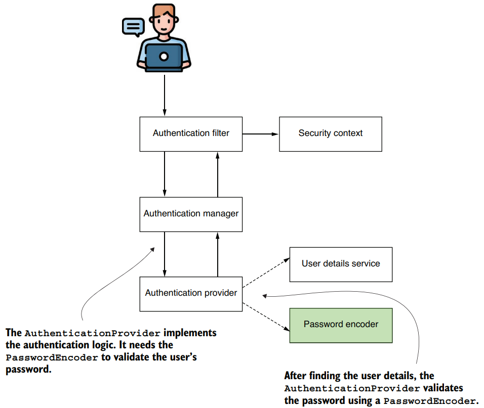
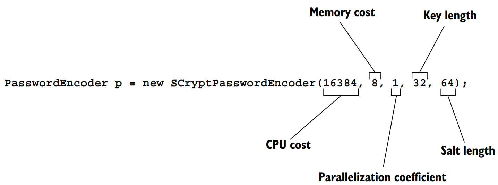
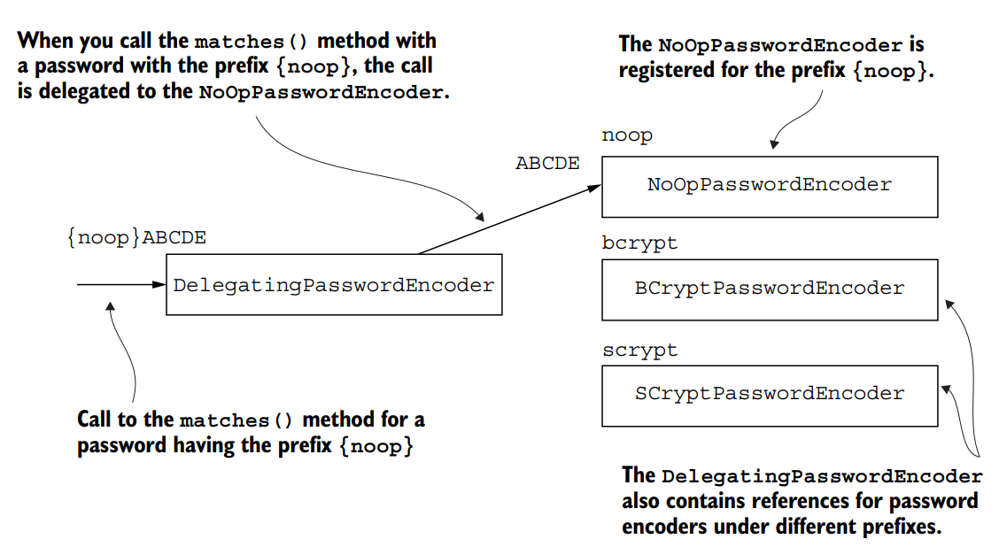
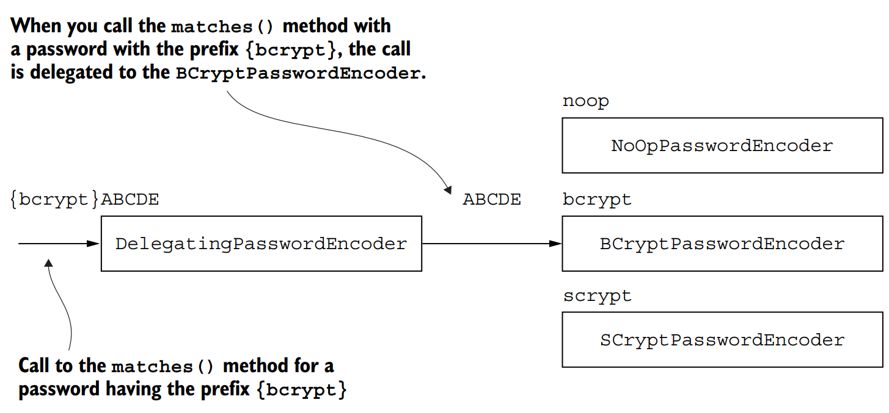

# Chapter 4 — Managing Passwords
### Revision Notes

---

## 1. The Big Picture: How Does Spring Security Manage Passwords?

Chapter 3 covered managing users. Passwords are an essential piece of the authentication flow, so this chapter covers how to manage passwords and secrets in a Spring Security application. It builds on the `UserDetailsService` and `PasswordEncoder` defaults introduced in chapter 2.

**This chapter covers:**
- Implementing and working with the `PasswordEncoder`
- Using the tools offered by the Spring Security Crypto module (SSCM)


*(The authentication flow: the `AuthenticationProvider` uses the `PasswordEncoder` to validate the user's password after finding the user details)*

**Key definition:**
> A `PasswordEncoder` is the Spring Security contract that tells the framework how to encode passwords and how to validate them during authentication.

---

## 2. Using Password Encoders

Systems don't manage passwords in plain text. Passwords are transformed so they are harder to read and steal, and Spring Security defines a separate contract for this. Order of the section: understand the contract, write your own implementation, then look at the provided implementations (section 2.3).

### 2.1 The `PasswordEncoder` Contract

- You implement it to tell Spring Security how to validate a user's password.
- During authentication, the `PasswordEncoder` decides whether a password is valid.
- Passwords should preferably be stored **hashed** so nobody can read them.
- `encode()` and `matches()` belong to the same contract because they are strongly linked: how a password is encoded determines how it is validated.

```java
public interface PasswordEncoder {
    String encode(CharSequence rawPassword);
    boolean matches(CharSequence rawPassword, String encodedPassword);
    default boolean upgradeEncoding(String encodedPassword) {
        return false;
    }
}
```

| Method | Type | Purpose |
|---|---|---|
| `encode(CharSequence rawPassword)` | abstract | Returns a transformation of the given string (an encryption or hash of the password) |
| `matches(CharSequence rawPassword, String encodedPassword)` | abstract | Checks whether an encoded string matches a raw password; used in authentication to test a provided password against known credentials |
| `upgradeEncoding(...)` | default (returns `false`) | If overridden to return `true`, the encoded password is encoded again for better security |

> **NOTE** — Re-encoding an already encoded password can make it harder to obtain the cleartext. The author personally dislikes this kind of obscurity, but the framework offers it if it fits your case.

> **NOTE** — The book's prose names the third method as `upgradeEncoding(CharSequence encodedPassword)`, while the interface listing shows `upgradeEncoding(String encodedPassword)`. The listing is reproduced above.

### 2.2 Implementing Your Own `PasswordEncoder`

**Rule:** `encode()` and `matches()` must always correspond. A string returned by `encode()` must be verifiable with `matches()` of the same encoder.

**Simplest implementation: plain text.** This is exactly what `NoOpPasswordEncoder` is (used in the first example of chapter 2).

**Listing 4.1 — The simplest implementation of a `PasswordEncoder`**

```java
public class PlainTextPasswordEncoder
    implements PasswordEncoder {

    @Override
    public String encode(CharSequence rawPassword) {
        return rawPassword.toString();   // ← we don't change the password, just return it as is
    }

    @Override
    public boolean matches(
        CharSequence rawPassword, String encodedPassword) {
        return rawPassword.equals(encodedPassword);   // ← checks if the two strings are equal
    }
}
```

- Encoding result is always the same as the password, so matching is just `equals()`.

**Listing 4.2 — Implementing a `PasswordEncoder` that uses SHA-512**

```java
public class Sha512PasswordEncoder
    implements PasswordEncoder {

    @Override
    public String encode(CharSequence rawPassword) {
        return hashWithSHA512(rawPassword.toString());
    }

    @Override
    public boolean matches(
        CharSequence rawPassword, String encodedPassword) {
        String hashedPassword = encode(rawPassword);
        return encodedPassword.equals(hashedPassword);
    }
    // Omitted code
}
```

- `encode()` returns the SHA-512 hash of the input.
- `matches()` hashes the raw password and compares it for equality with the stored hash.

**Listing 4.3 — The method that hashes the input with SHA-512**

```java
private String hashWithSHA512(String input) {
    StringBuilder result = new StringBuilder();
    try {
        MessageDigest md = MessageDigest.getInstance("SHA-512");
        byte [] digested = md.digest(input.getBytes());
        for (int i = 0; i < digested.length; i++) {
            result.append(Integer.toHexString(0xFF & digested[i]));
        }
    } catch (NoSuchAlgorithmException e) {
        throw new RuntimeException("Bad algorithm");
    }
    return result.toString();
}
```

> **NOTE** — The author says not to worry too much about this code: better options come in the next section.

---

### 2.3 Choosing from the Provided `PasswordEncoder` Implementations

If a provided implementation fits your application, don't rewrite it.

| Implementation | Recommended? | Notes |
|---|---|---|
| `NoOpPasswordEncoder` | ❌ | No encoding, keeps cleartext. Examples only; never in real-world use |
| `StandardPasswordEncoder` | ❌ | Uses SHA-256. **Deprecated** (algorithm no longer considered strong). May appear in legacy apps; replace with a stronger encoder |
| `Pbkdf2PasswordEncoder` | ✅ | Uses password-based key derivation function 2 (PBKDF2) |
| `BCryptPasswordEncoder` | ✅ | Uses the bcrypt strong hashing function |
| `SCryptPasswordEncoder` | ✅ | Uses the scrypt hashing function |

> **NOTE** — For more on hashing and these algorithms, the author points to chapter 2 of *Real-World Cryptography* by David Wong (Manning, 2021), at http://mng.bz/QRJw.

#### `NoOpPasswordEncoder`

- Similar to `PlainTextPasswordEncoder` in listing 4.1, so only used in theoretical examples.
- Designed as a **singleton**: the constructor can't be called from outside, so use `getInstance()`.

```java
PasswordEncoder p = NoOpPasswordEncoder.getInstance();
```

#### `StandardPasswordEncoder`

- Uses SHA-256.
- You can pass a **secret** through the constructor to be used in hashing; the no-args constructor uses the **empty string** as the key.
- ⚠️ Deprecated; the author doesn't recommend it for new implementations, but you should recognise it in older code.

```java
PasswordEncoder p = new StandardPasswordEncoder();
PasswordEncoder p = new StandardPasswordEncoder("secret");
```

#### `Pbkdf2PasswordEncoder`

```java
PasswordEncoder p =
    new Pbkdf2PasswordEncoder("secret", 16, 310000, Pbkdf2PasswordEncoder.
SecretKeyFactoryAlgorithm.PBKDF2WithHmacSHA256);
```

- PBKDF2 is a fairly easy, **slow-hashing** function that performs an HMAC as many times as the iterations argument says.
- Parameters:
  - 1st: value of a key used for the encoding process (`"secret"`)
  - 2nd/3rd: the book says the first three parameters are the key, the number of iterations, and the size of the hash. The 2nd and 3rd influence the strength of the result.
  - 4th: the hash width (algorithm), one of:
    - `PBKDF2WithHmacSHA1`
    - `PBKDF2WithHmacSHA256`
    - `PBKDF2WithHmacSHA512`
- You can choose more or fewer iterations and a different result length. The longer the hash, the stronger the password (the same holds for hash width).
- ⚠️ Performance trade-off: more iterations means more resources consumed. Compromise between resources spent generating the hash and the needed strength.

> **NOTE** — The book's description of the parameters is slightly inconsistent: the code shows `(secret, 16, 310000, algorithm)`, but the text lists the three parameters as key, iterations, and hash size. The order of the 2nd and 3rd is not spelled out clearly, so check the API docs for exact meaning.

> **NOTE** — For HMAC and other cryptography details, see chapter 3 of *Real-World Cryptography* by David Wong (Manning, 2021), at http://mng.bz/XqJG.

#### `BCryptPasswordEncoder`

- Uses a bcrypt strong hashing function.
- Can use the no-args constructor, or specify a **strength coefficient** (the *log rounds*), and optionally a custom `SecureRandom`.

```java
PasswordEncoder p = new BCryptPasswordEncoder();
PasswordEncoder p = new BCryptPasswordEncoder(4);
SecureRandom s = SecureRandom.getInstanceStrong();
PasswordEncoder p = new BCryptPasswordEncoder(4, s);
```

- Number of iterations = **2^(log rounds)**.
- Log rounds value must be between **4 and 31**.
- Set through the 2nd or 3rd overloaded constructors.

#### `SCryptPasswordEncoder`

- Uses the scrypt hashing function.


*(The `SCryptPasswordEncoder` constructor's five parameters: CPU cost, memory cost, parallelization coefficient, key length, salt length)*

```java
PasswordEncoder p = new SCryptPasswordEncoder(16384, 8, 1, 32, 64);
```

| Parameter (in order) | Value |
|---|---|
| CPU cost | 16384 |
| Memory cost | 8 |
| Parallelization coefficient | 1 |
| Key length | 32 |
| Salt length | 64 |

> **NOTE** — The book's text names the class `ScryptPasswordEncoder` once, but everywhere else (and in code) it is `SCryptPasswordEncoder`. Also, the figure's caption mentions only CPU cost, memory cost, key length and salt length, while the figure itself lists five parameters including the parallelization coefficient.

---

### 2.4 Multiple Encoding Strategies with `DelegatingPasswordEncoder`

**Use case:** the authentication flow must apply various implementations to match passwords.

**Common scenario:** the encoding algorithm changes starting from a particular application version. A vulnerability is found in the current algorithm, so you change it for **newly registered users** but keep the old one for existing credentials. You end up with multiple kinds of hashes. A good choice (not the only one) is a `DelegatingPasswordEncoder`.

**How it works:**
- Implements `PasswordEncoder` but has **no algorithm of its own**; it delegates to another `PasswordEncoder` implementation.
- The hash starts with a **prefix** naming the algorithm used to produce it.
- It delegates to the right implementation based on that prefix.
- It stores its encoders in a **map**: e.g. `noop` → `NoOpPasswordEncoder`, `bcrypt` → `BCryptPasswordEncoder`.
  - Prefix `{noop}` → `NoOpPasswordEncoder`
  - Prefix `{bcrypt}` → `BCryptPasswordEncoder`


*(A `DelegatingPasswordEncoder` with `noop`, `bcrypt`, and `scrypt` encoders; a `{noop}` password is routed to `NoOpPasswordEncoder`)*


*(The same setup routing a `{bcrypt}`-prefixed password to `BCryptPasswordEncoder`)*

**Listing 4.4 — Creating an instance of `DelegatingPasswordEncoder`**

```java
@Configuration
public class ProjectConfig {
    // Omitted code
    @Bean
    public PasswordEncoder passwordEncoder() {
        Map<String, PasswordEncoder> encoders = new HashMap<>();
        encoders.put("noop", NoOpPasswordEncoder.getInstance());
        encoders.put("bcrypt", new BCryptPasswordEncoder());
        encoders.put("scrypt", new SCryptPasswordEncoder());
        return new DelegatingPasswordEncoder("bcrypt", encoders);   // ← "bcrypt" = default encoder
    }
}
```

- It's just a tool that acts as a `PasswordEncoder`; use it when choosing from a collection of implementations.
- The prefix is the **key** that identifies which encoder to use from the map.
- **No prefix** → the **default** encoder is used. The default is the **first parameter** of the constructor (here, `bcrypt`).

> **NOTE** — The curly braces are part of the hash prefix and surround the key name. For `{noop}12345`, it delegates to the `NoOpPasswordEncoder` registered for `noop`. ⚠️ The curly braces are **mandatory**.

A hash like the one below is handled by `BCryptPasswordEncoder`. It is also what gets used if there is no prefix at all, since bcrypt is the default:

```
{bcrypt}$2a$10$xn3LI/AjqicFYZFruSwve.681477XaVNaUQbr1gioaWPn4t1KsnmG
```

**Convenience factory:** `PasswordEncoderFactories.createDelegatingPasswordEncoder()` is a static method returning a `DelegatingPasswordEncoder` with a full set of mappings for all the standard provided implementations, and `bcrypt` as the default.

```java
PasswordEncoder passwordEncoder =
    PasswordEncoderFactories.createDelegatingPasswordEncoder();
```

---

### 2.5 Encoding vs. Encrypting vs. Hashing

| Term | Definition | Function form |
|---|---|---|
| **Encoding** | Any transformation of a given input | e.g. a function `x` that reverses a string: `ABCD` → `DCBA` (`x -> y`) |
| **Encryption** | A particular type of encoding where both the input and a **key** are needed for the output; the key determines who can reverse it | `(x, k) -> y`; decryption: `(y, k) -> x` |
| **Hashing** | A particular type of encoding where the function is **one way**: you can't get the input `x` back from `y` | `x -> y`, plus a matching function `(x, y) -> boolean` |

**Encryption details:**
- Same key for encryption and decryption → usually called a **symmetric key**.
- Two different keys, `(x, k1) -> y` and `(y, k2) -> x` → **asymmetric keys**.
  - `(k1, k2)` is a **key pair**.
  - `k1` (used for encryption) = **public key**.
  - `k2` = **private key**. Only the owner of the private key can decrypt the data.

**Hashing details:**
- There must always be a way to check that an output `y` corresponds to an input `x`, so hashing is understood as a pair of functions: encoding and matching.
- A hash function can also use a random value added to the input: `(x, k) -> y`. That value is the **salt**. It makes the function stronger by making it harder to reverse and get the input from the result.

### 2.6 Recap: Main Authentication Contracts

**Table 4.1 — The interfaces that represent the main contracts for the authentication flow**

| Contract | Description |
|---|---|
| `UserDetails` | Represents the user as seen by Spring Security |
| `GrantedAuthority` | Defines an action within the purpose of the application that is allowable to the user (e.g. read, write, delete) |
| `UserDetailsService` | Represents the object used to retrieve user details by username |
| `UserDetailsManager` | A more particular contract for `UserDetailsService`; besides retrieving a user by username, it can also mutate a collection of users or a specific user |
| `PasswordEncoder` | Specifies how the password is encrypted or hashed and how to check whether a given encoded string matches a plaintext password |

---

## 3. Taking Advantage of the Spring Security Crypto Module

The **Spring Security Crypto module (SSCM)** is the part of Spring Security that deals with cryptography.

- Java doesn't offer encryption/decryption functions and key generation out of the box, forcing developers to add dependencies.
- Spring Security provides its own solution, reducing project dependencies by removing the need for a separate library.
- The password encoders are also part of the SSCM (even though they were treated separately above).

Two essential features of the SSCM:

| Feature | Purpose |
|---|---|
| **Key generators** | Objects used to generate keys for hashing and encryption algorithms |
| **Encryptors** | Objects used to encrypt and decrypt data |

---

### 3.1 Using Key Generators

A **key generator** is an object that generates a specific kind of key, generally required by an encryption or hashing algorithm. The author recommends using these implementations over adding another dependency.

Two interfaces represent the two types of key generators, both built via the factory class `KeyGenerators`:
- `StringKeyGenerator`
- `BytesKeyGenerator`

#### `StringKeyGenerator`

- Returns a key as a string; usually used as a **salt** for hashing or encryption.

```java
public interface StringKeyGenerator {
    String generateKey();
}
```

```java
StringKeyGenerator keyGenerator = KeyGenerators.string();
String salt = keyGenerator.generateKey();
```

- The generator creates an **8-byte** key and encodes it as a **hexadecimal string**.

#### `BytesKeyGenerator`

```java
public interface BytesKeyGenerator {
    int getKeyLength();
    byte[] generateKey();
}
```

- `generateKey()` returns the key as `byte[]`.
- `getKeyLength()` returns the key length in number of bytes.
- Default generator creates **8-byte** keys.

```java
BytesKeyGenerator keyGenerator = KeyGenerators.secureRandom();
byte [] key = keyGenerator.generateKey();
int keyLength = keyGenerator.getKeyLength();
```

Different key length: pass it to `secureRandom()`:

```java
BytesKeyGenerator keyGenerator = KeyGenerators.secureRandom(16);
```

- Keys from `KeyGenerators.secureRandom()` are **unique for each call** of `generateKey()`.
- To get the **same key on each call**, use `KeyGenerators.shared(int length)`. Below, `key1` and `key2` have the same value:

```java
BytesKeyGenerator keyGenerator = KeyGenerators.shared(16);
byte [] key1 = keyGenerator.generateKey();
byte [] key2 = keyGenerator.generateKey();
```

| Factory method | Returns | Key behaviour |
|---|---|---|
| `KeyGenerators.string()` | `StringKeyGenerator` | 8-byte key as hex string |
| `KeyGenerators.secureRandom()` | `BytesKeyGenerator` | 8-byte key, unique per call |
| `KeyGenerators.secureRandom(16)` | `BytesKeyGenerator` | Custom length, unique per call |
| `KeyGenerators.shared(16)` | `BytesKeyGenerator` | Same key every call |

---

### 3.2 Encrypting and Decrypting Secrets Using Encryptors

An **encryptor** is an object that implements an encryption algorithm. Encryption and decryption are common security operations, and data often needs encrypting when sent between components or when persisted.

Two types defined by the SSCM: `BytesEncryptor` and `TextEncryptor`. They have similar responsibilities but treat different data types.

```java
public interface TextEncryptor {
    String encrypt(String text);
    String decrypt(String encryptedText);
}
```

```java
public interface BytesEncryptor {
    byte[] encrypt(byte[] byteArray);
    byte[] decrypt(byte[] encryptedByteArray);
}
```

- `TextEncryptor`: strings in, strings out.
- `BytesEncryptor`: more generic, works on byte arrays.

The factory class `Encryptors` offers multiple ways to build encryptors.

#### `BytesEncryptor`: `standard()` and `stronger()`

```java
String salt = KeyGenerators.string().generateKey();
String password = "secret";
String valueToEncrypt = "HELLO";
BytesEncryptor e = Encryptors.standard(password, salt);
byte [] encrypted = e.encrypt(valueToEncrypt.getBytes());
byte [] decrypted = e.decrypt(encrypted);
```

- The standard byte encryptor uses **256-byte AES** encryption behind the scenes.

> **NOTE** — The book says "256-byte AES", but later refers to "AES encryption on 256-bit". AES-256 is a 256-**bit** key, so "256-byte" appears to be a typo in the book.

Stronger instance:

```java
BytesEncryptor e = Encryptors.stronger(password, salt);
```

- The difference is small and happens behind the scenes: AES-256 with **Galois/Counter Mode (GCM)** as the mode of operation.
- The standard mode uses **cipher block chaining (CBC)**, considered a weaker method.

#### `TextEncryptor`

The book says `TextEncryptor`s come in three main types, created by calling `Encryptors.text()` or `Encryptors.delux()`, plus a no-op variant.

> **NOTE** — The book says "three main types" but names only `text()` and `delux()` as creating them, then separately describes `noOpText()`. That gives three factory methods in total. The exact grouping isn't stated clearly.

**No-op `TextEncryptor`:**
- A dummy encryptor that **doesn't encrypt** the value.
- Use for demo examples, or for testing application performance without spending time on encryption.
- Created by `Encryptors.noOpText()`.
- In the example, `encrypted` and `valueToEncrypt` are the same.

```java
String valueToEncrypt = "HELLO";
TextEncryptor e = Encryptors.noOpText();
String encrypted = e.encrypt(valueToEncrypt);
```

**`text()` vs `delux()`:**
- `Encryptors.text()` uses `Encryptors.standard()` to manage encryption.
- `Encryptors.delux()` uses an `Encryptors.stronger()` instance.

```java
String salt = KeyGenerators.string().generateKey();
String password = "secret";
String valueToEncrypt = "HELLO";
TextEncryptor e = Encryptors.text(password, salt);   // ← creates a TextEncryptor that uses a salt and a password
String encrypted = e.encrypt(valueToEncrypt);
String decrypted = e.decrypt(encrypted);
```

| Factory method | Type | Underlying behaviour |
|---|---|---|
| `Encryptors.standard(password, salt)` | `BytesEncryptor` | AES-256, CBC mode |
| `Encryptors.stronger(password, salt)` | `BytesEncryptor` | AES-256, GCM mode |
| `Encryptors.text(password, salt)` | `TextEncryptor` | Uses `standard()` |
| `Encryptors.delux(password, salt)` | `TextEncryptor` | Uses `stronger()` |
| `Encryptors.noOpText()` | `TextEncryptor` | Dummy; no encryption |

---

## 4. Summary of All Approaches

| Approach | Syntax / Tool | When to use |
|---|---|---|
| Plain text | `NoOpPasswordEncoder.getInstance()` | ❌ Examples only, never in real-world scenarios |
| SHA-256 hashing | `new StandardPasswordEncoder("secret")` | ❌ Deprecated; only recognise it in legacy code and replace it |
| PBKDF2 | `new Pbkdf2PasswordEncoder("secret", 16, 310000, ...PBKDF2WithHmacSHA256)` | Slow hashing with tunable iterations and hash width |
| bcrypt | `new BCryptPasswordEncoder(4)` | Strong hashing with tunable log rounds (4–31) |
| scrypt | `new SCryptPasswordEncoder(16384, 8, 1, 32, 64)` | Hashing with CPU/memory cost, parallelization, key and salt length |
| Multiple algorithms side by side | `new DelegatingPasswordEncoder("bcrypt", encoders)` | Migrating algorithms while keeping existing hashes valid |
| All standard encoders, bcrypt default | `PasswordEncoderFactories.createDelegatingPasswordEncoder()` | Convenience when you want the full standard set |
| Custom encoder | `implements PasswordEncoder` (`encode()`, `matches()`) | Only when no provided implementation fits |
| String salt/key | `KeyGenerators.string()` | Hex-string key (8 bytes), e.g. as a salt |
| Byte key, unique each call | `KeyGenerators.secureRandom(16)` | Random byte keys |
| Byte key, same each call | `KeyGenerators.shared(16)` | Same key value on every call |
| Byte encryption | `Encryptors.standard()` / `Encryptors.stronger()` | Encrypt/decrypt `byte[]` |
| Text encryption | `Encryptors.text()` / `Encryptors.delux()` | Encrypt/decrypt strings |
| No encryption (demo/perf tests) | `Encryptors.noOpText()` | Demos or performance tests |

---

## Quick-Reference Summary

| Concept | One-liner |
|---|---|
| `PasswordEncoder` | One of the most critical responsibilities in authentication logic: dealing with passwords |
| `encode()` | Returns a transformation (encryption or hash) of the raw password |
| `matches()` | Checks whether an encoded string corresponds to a raw password |
| `upgradeEncoding()` | Defaults to `false`; if `true`, the encoded password is encoded again |
| `NoOpPasswordEncoder` | Cleartext, singleton via `getInstance()`, examples only |
| `StandardPasswordEncoder` | SHA-256, deprecated |
| `Pbkdf2PasswordEncoder` | PBKDF2 slow hash; iterations and hash width affect strength and performance |
| `BCryptPasswordEncoder` | bcrypt; iterations = 2^(log rounds), log rounds 4–31 |
| `SCryptPasswordEncoder` | scrypt; five constructor parameters |
| `DelegatingPasswordEncoder` | Delegates to other encoders by `{prefix}`; falls back to the default encoder when no prefix |
| `PasswordEncoderFactories.createDelegatingPasswordEncoder()` | `DelegatingPasswordEncoder` with all standard mappings and bcrypt default |
| Encoding | Any transformation of an input |
| Encryption | Encoding using a key; reversible by whoever holds the right key (symmetric or asymmetric) |
| Hashing | One-way encoding paired with a matching function; may use a salt |
| SSCM | Spring Security Crypto module: cryptography support without extra libraries |
| `StringKeyGenerator` / `BytesKeyGenerator` | Key generators returning a string / byte array (default 8 bytes) |
| `KeyGenerators` | Factory: `string()`, `secureRandom()`, `secureRandom(n)`, `shared(n)` |
| `BytesEncryptor` / `TextEncryptor` | Encrypt and decrypt bytes / strings |
| `Encryptors` | Factory: `standard()`, `stronger()`, `text()`, `delux()`, `noOpText()` |

**Chapter summary points:**
- The `PasswordEncoder` has one of the most critical responsibilities in authentication logic: dealing with passwords.
- Spring Security offers several alternatives for hashing algorithms, so the implementation is only a matter of choice.
- The SSCM offers various alternatives for implementing key generators and encryptors.
- Key generators are utility objects that help generate keys used with cryptographic algorithms.
- Encryptors are utility objects that help apply data encryption and decryption.

---
