# Chapter 5 — A Web App's Security Begins with Filters
### Revision Notes

---

## 1. The Big Picture: What Is the Filter Chain?

In Spring Security, HTTP filters each take one responsibility for a request. Together they form a **chain of responsibilities**. A filter receives the request, runs its logic, then delegates to the next filter in the chain. This builds on chapters 2 and 3, where the authentication filter intercepts the request and hands authentication off to a manager.

**This chapter covers:**
- Working with the filter chain
- Defining custom filters
- Using Spring Security classes that implement the `Filter` interface

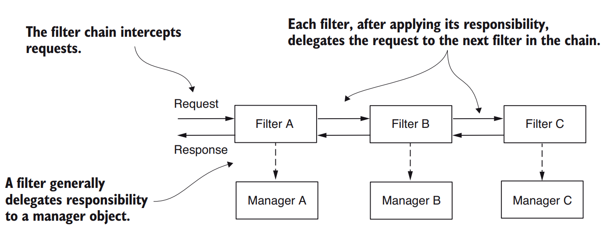
*(The request passes through Filter A → B → C, each delegating its work to a manager object)*

**Analogy:** An airport. From entering the terminal to boarding, you pass several filters: ticket check, passport verification, security. At the gate there may be more (e.g. passport and visa checked again). Spring Security works the same way: it provides filter implementations you add through configuration, and you can also define your own.

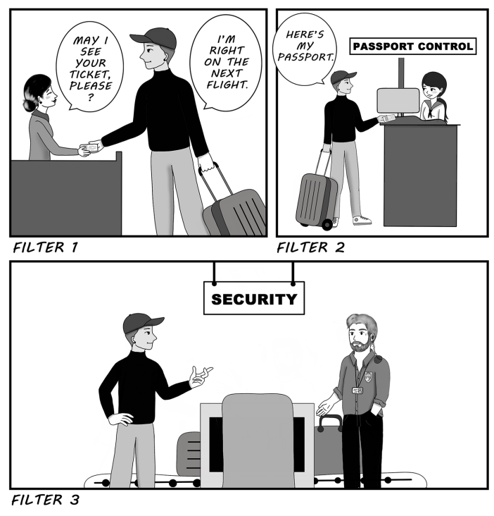
*(Airport checkpoints as an analogy for a sequence of filters processing each HTTP request)*

**Why customize filters?**
- Add an extra authentication step (e.g. email check, one-time password).
- Audit authentication events (debugging, analysing user behaviour; ML can even detect hacked or impersonated accounts).
- Default config (HTTP Basic with username and password) often isn't enough. You may need a different authentication strategy, to notify an external system on an authorization event, or to log successful or failed authentication for tracing and auditing.
- Spring Security lets you model the chain exactly as you need.

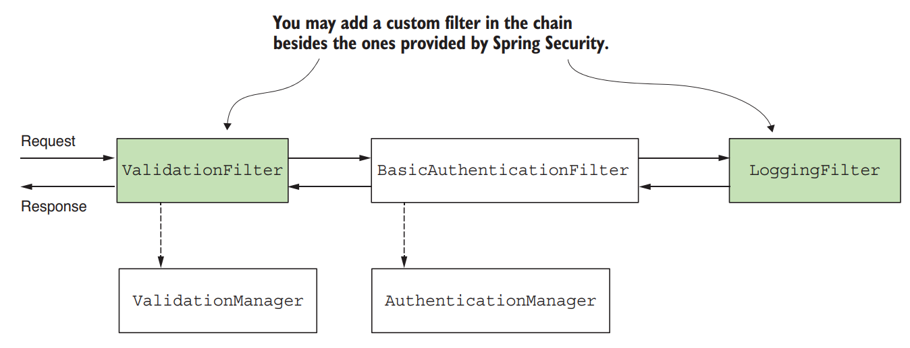
*(A custom filter (e.g. ValidationFilter, LoggingFilter) inserted among Spring Security's own filters)*

You can insert new filters **before, after, or in place of** existing ones. This customizes not just authentication but the whole handling of requests and responses.

---

## 2. Implementing Filters in the Spring Security Architecture

To run logic *before* authentication, insert a filter before the authentication filter.

Filters are ordinary HTTP filters. You create one by implementing `jakarta.servlet.Filter` and overriding `doFilter()`, which takes three parameters:

| Parameter | Represents | Used for |
|---|---|---|
| `ServletRequest` | The HTTP request | Reading request details |
| `ServletResponse` | The HTTP response | Altering the response before it goes back to the client or further along the chain |
| `FilterChain` | The chain of filters | Forwarding the request to the next filter |

> **NOTE** — Spring Boot 3 moved from Java EE to Jakarta EE, so package prefixes changed from `javax` to `jakarta`. `Filter`, `ServletRequest` and `ServletResponse` now live in `jakarta.servlet`.

**The filter chain** is a collection of filters with a defined order. Some provided filters:
- `BasicAuthenticationFilter`: handles HTTP Basic authentication, if present.
- `CsrfFilter`: handles cross-site request forgery protection (chapter 9).
- `CorsFilter`: handles cross-origin resource sharing rules (chapter 10).

You don't need to know every filter, since you rarely touch them directly. You do need to understand how the chain works and a few implementations.

**The chain isn't fixed.** It is longer or shorter depending on your configuration. For example, calling `httpBasic()` on `HttpSecurity` adds a `BasicAuthenticationFilter` instance to the chain.

**Positions:**
- You add a new filter *relative* to a known one: before, after, or at its position.
- Each position is an index (a number), also called "the order".

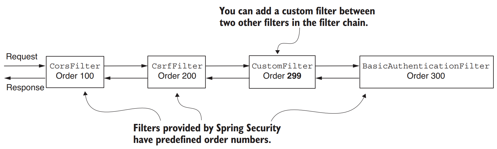
*(Filters have order numbers (Cors 100, Csrf 200, Basic 300); a custom filter can sit between two of them)*

- For the full list and order of provided filters, see enum `SecurityWebFiltersOrder` (http://mng.bz/yZEG).

### ⚠️ Important: Same position = undefined order

You can add two or more filters at the same position. If multiple filters share a position, the order in which they are called is **not defined**. This commonly confuses developers (see section 5 of these notes).

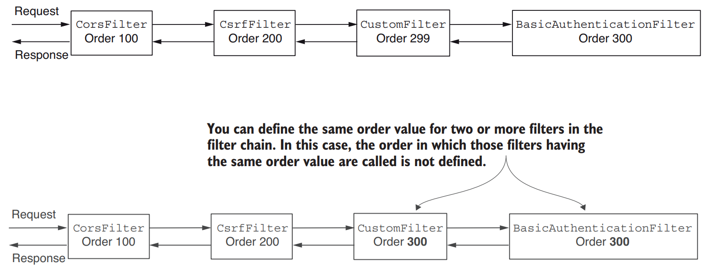
*(Two filters sharing order 300 in the chain, so Spring Security doesn't guarantee which runs first)*

---

## 3. Adding a Filter Before an Existing One in the Chain

*Project: `ssia-ch5-ex1`*

**Scenario:** Every request must have a header called `Request-Id`, which the app uses for request tracking and which is mandatory. Validate this *before* authentication, because authentication may hit the database or other expensive resources that we shouldn't spend on an invalid request.

**Two steps:**
1. Implement the filter: `RequestValidationFilter` checks that the needed header exists.
2. Add it to the chain in the configuration class via the `SecurityFilterChain` bean.

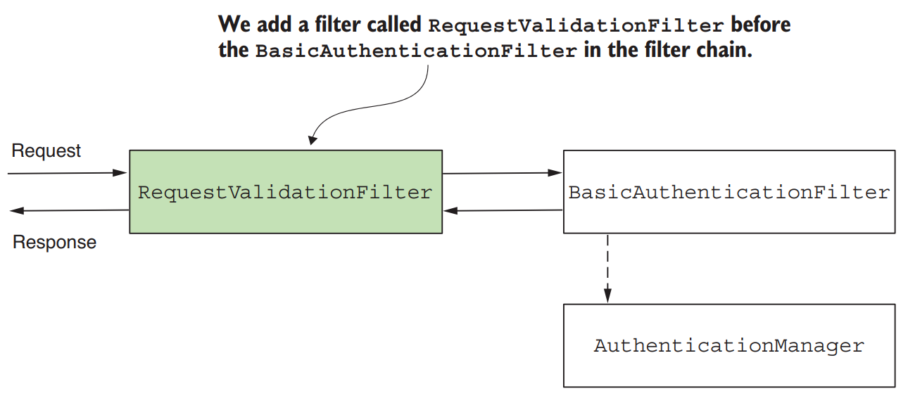
*(RequestValidationFilter added before BasicAuthenticationFilter in the chain)*

**Step 1: implement the filter** (skeleton):

```java
public class RequestValidationFilter
  implements Filter {                          // ← implements the Filter interface

  @Override
  public void doFilter(
    ServletRequest servletRequest,
    ServletResponse servletResponse,
    FilterChain filterChain)
    throws IOException, ServletException {
    // ...
  }
}
```

**Logic inside `doFilter()`:**
- Header exists → forward to the next filter with `doFilter()`.
- Header missing → set HTTP status **400 Bad Request** and do **not** forward.

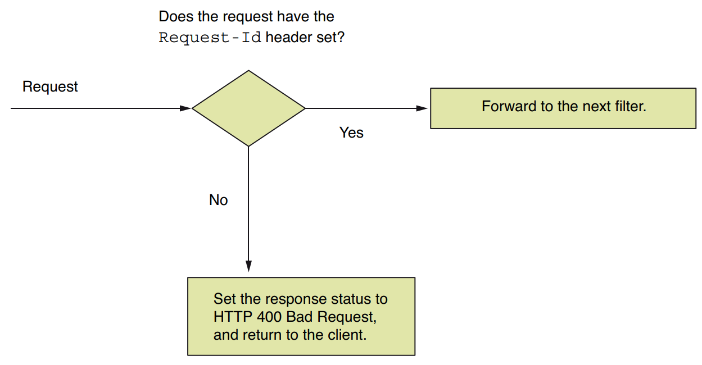
*(Flow: Request-Id header present → forward to next filter; absent → 400 Bad Request returned to client)*

```java
@Override
public void doFilter(
  ServletRequest request,
  ServletResponse response,
  FilterChain filterChain)
  throws IOException,
         ServletException {

  var httpRequest = (HttpServletRequest) request;
  var httpResponse = (HttpServletResponse) response;

  String requestId = httpRequest.getHeader("Request-Id");

  if (requestId == null || requestId.isBlank()) {
    httpResponse.setStatus(HttpServletResponse.SC_BAD_REQUEST);   // ← 400, not forwarded
    return;
  }

  filterChain.doFilter(request, response);                        // ← header OK, forward
}
```

**Step 2: add the filter** with `addFilterBefore()`, which takes two parameters:

| Parameter | In this example |
|---|---|
| Instance of the custom filter | `new RequestValidationFilter()` |
| Type of the filter before which to add it | `BasicAuthenticationFilter.class` (the default authentication filter type) |

Note: "the authentication filter" has so far been used generically. Spring Security configures other filters too, and CSRF (ch. 9) and CORS (ch. 10) also rely on filters.

`permitAll()` is used to keep the example simple (allows all unauthenticated requests).

```java
@Configuration
public class ProjectConfig {

  @Bean
  public SecurityFilterChain securityFilterChain(HttpSecurity http)
    throws Exception {

    http.addFilterBefore(                                       // ← add before authentication filter
          new RequestValidationFilter(), BasicAuthenticationFilter.class)
        .authorizeRequests(c -> c.anyRequest().permitAll());

    return http.build();
  }
}
```

**Controller for testing:**

```java
@RestController
public class HelloController {

  @GetMapping("/hello")
  public String hello() {
    return "Hello!";
  }
}
```

**Testing:**

Without the header → 400 Bad Request:
```bash
curl -v http://localhost:8080/hello
```
```
...
< HTTP/1.1 400
...
```

With the header → 200 OK and body:
```bash
curl -H "Request-Id:12345" http://localhost:8080/hello
```
```
Hello!
```

---

## 4. Adding a Filter After an Existing One in the Chain

Use this to run logic *after* something already in the chain, for example notifying another system after authentication events, or logging and tracing.

**Example:** Log every successful authentication by adding a filter after the authentication filter. Anything that gets past the authentication filter counts as a successful authentication. Continuing from section 3, also log the `Request-Id` header value.

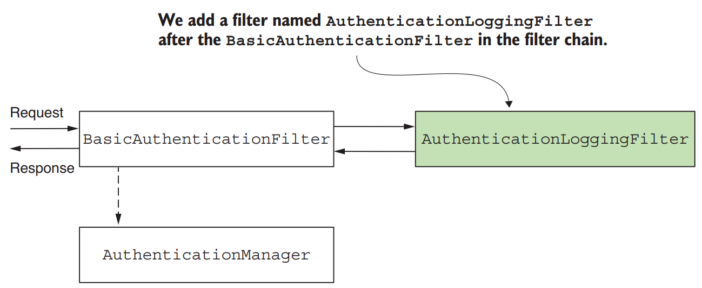
*(AuthenticationLoggingFilter added after BasicAuthenticationFilter to log authenticated requests)*

**The logging filter:**

```java
public class AuthenticationLoggingFilter implements Filter {

  private final Logger logger =
    Logger.getLogger(
      AuthenticationLoggingFilter.class.getName());

  @Override
  public void doFilter(
    ServletRequest request,
    ServletResponse response,
    FilterChain filterChain)
    throws IOException, ServletException {

    var httpRequest = (HttpServletRequest) request;

    var requestId =
      httpRequest.getHeader("Request-Id");                      // ← get request ID from headers

    logger.info("Successfully authenticated " +
      "request with id " + requestId);                          // ← log the event

    filterChain.doFilter(request, response);                    // ← forward to next filter
  }
}
```

**Adding it** with `addFilterAfter()`:

```java
@Configuration
public class ProjectConfig {

  @Bean
  public SecurityFilterChain securityFilterChain(HttpSecurity http)
    throws Exception {

    http.addFilterBefore(
          new RequestValidationFilter(),
          BasicAuthenticationFilter.class)
        .addFilterAfter(                                        // ← after the authentication filter
          new AuthenticationLoggingFilter(),
          BasicAuthenticationFilter.class)
        .authorizeRequests(c -> c.anyRequest().permitAll());

    return http.build();
  }
}
```

**Result:** Every successful call prints a log line. For:
```bash
curl -H "Request-Id:12345" http://localhost:8080/hello
```
Response body:
```
Hello!
```
Console:
```
INFO 5876 --- [nio-8080-exec-2]
c.l.s.f.AuthenticationLoggingFilter:
Successfully authenticated request with id 12345
```

> **NOTE** — The log line above is reproduced from a PDF where line breaks were garbled (`[CA]` markers); it was rejoined into a single log line.

---

## 5. Adding a Filter at the Location of Another in the Chain

Use this to provide a *different implementation* for a responsibility already handled by a known Spring Security filter. Typical case: **authentication**.

- حلي بالك يبويا انه لما بتحط custom filter مكان filter تبع الفريم ورك فمينفعش في ال addFilterBefore او ال addFilterAfter انك تحط الريفرنس ال class ال custom و انما تحط اللي الفريم وورك عارفه يعني مثلا انت عملت custom filter بتستبدل به ال BasicHttp filter فعملتها ب addFilterAt و الدنيا حلوة فلما تيجي بقي تستخدم ال before و ال after هتحط البارميتر التاني ب BasicHttp filter مش ال custom filter بتاعك فخلي بالك من ده.

**Example scenarios** where you'd replace HTTP Basic (username and password):
- Identification based on a **static header value**.
- A **symmetric key** used to sign the request.
- A **one-time password (OTP)**.

### 5.1 The three authentication scenarios

**Scenario 1: static key**
- The client sends the same string in an HTTP header on every request.
- The app stores the value (likely in a database or secrets vault) and identifies the client from it.
- **Weak security**, but often chosen for backend-to-backend calls because it is simple and fast (no complex calculation such as a cryptographic signature).
- It's a compromise: developers lean more on infrastructure-level security, but the endpoints aren't left wholly unprotected.

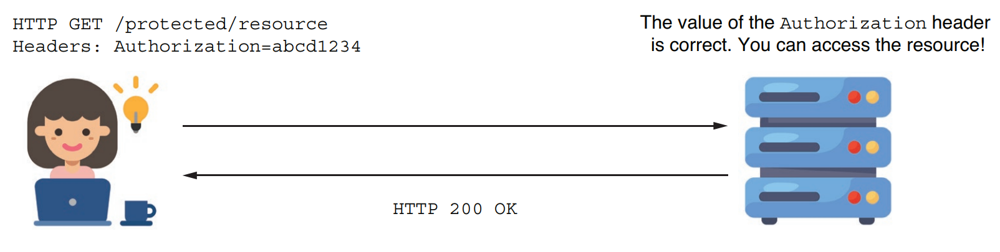
*(Request with a static key in the Authorization header; the server accepts it if it matches)*

**Scenario 2: symmetric keys (signing)**
- Client and server share a key.
- The client signs part of the request (e.g. specific header values), and the server verifies the signature with the same key.
- The server can store individual keys per client (database or secrets vault).
- You can similarly use a pair of asymmetric keys.


*(Authorization header carrying a signed value that the server validates)*

**Scenario 3: OTP**
- The user receives the OTP via a message or an authenticator app such as Google Authenticator.
- The OTP is acquired from an external authentication server.
- Typically used for logins requiring multi-factor authentication.

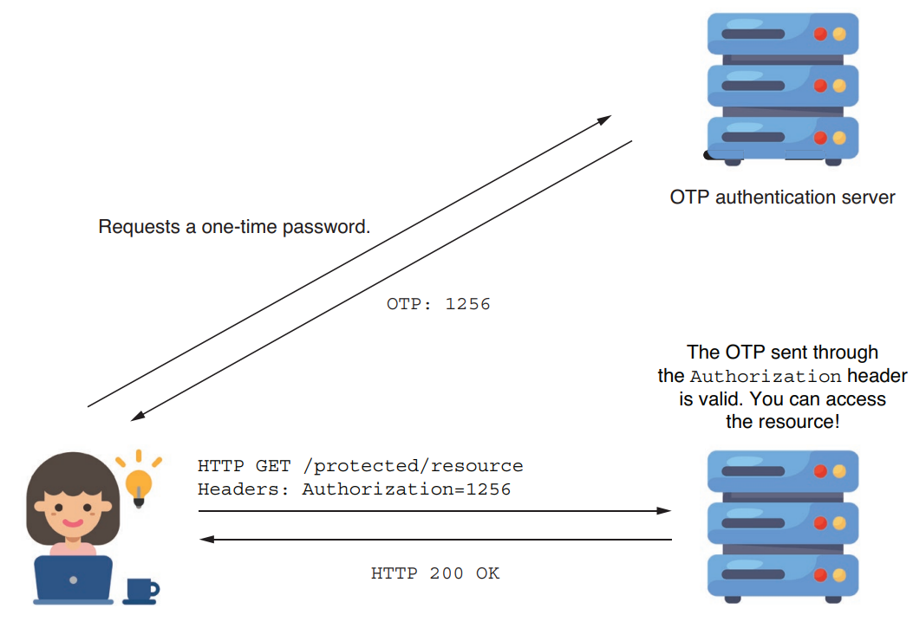
*(Client obtains an OTP from an OTP server, then sends it in the Authorization header)*

### 5.2 Worked example: static key filter

*Project: `ssia-ch5-ex2`*

**Setup:** One static key, the same for all requests. The user must send the correct value in the `Authorization` header.

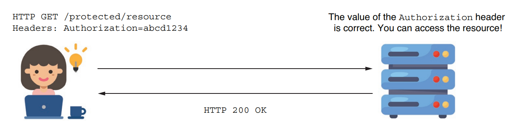
*(Client sends the static key in the Authorization header; the server checks it before authorizing)*

**`StaticKeyAuthenticationFilter`:**
- Reads the static key from the properties file.
- Compares it with the `Authorization` header.
- Equal → forward to the next component in the chain.
- Not equal → set **401 Unauthorized**, do not forward.

```java
@Component                                                       // ← in Spring context so @Value injection works
public class StaticKeyAuthenticationFilter
  implements Filter {

  @Value("${authorization.key}")                                 // ← static key from properties file
  private String authorizationKey;

  @Override
  public void doFilter(ServletRequest request,
                       ServletResponse response,
                       FilterChain filterChain)
    throws IOException, ServletException {

    var httpRequest = (HttpServletRequest) request;
    var httpResponse = (HttpServletResponse) response;

    String authentication =
      httpRequest.getHeader("Authorization");                    // ← header value to compare

    if (authorizationKey.equals(authentication)) {
      filterChain.doFilter(request, response);
    } else {
      httpResponse.setStatus(
        HttpServletResponse.SC_UNAUTHORIZED);
    }
  }
}
```

**Adding it** with `addFilterAt()` at the position of `BasicAuthenticationFilter`:

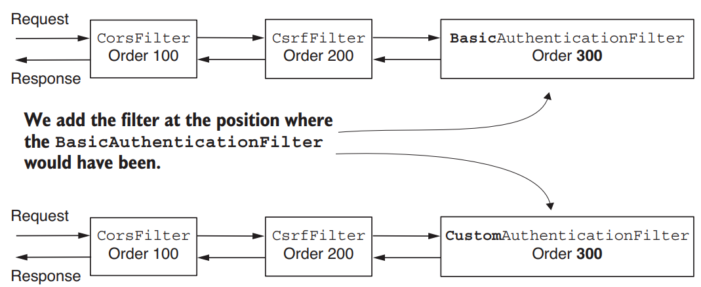
*(Custom authentication filter placed at order 300, where BasicAuthenticationFilter would have been)*

### ⚠️ Important: `addFilterAt()` does NOT replace the existing filter

- Spring Security doesn't assume your filter is the only one at that position.
- Other filters can share the same position, and then their order is **not guaranteed**.
- Many developers wrongly think the filter at that position gets replaced. It doesn't! Make sure you don't add filters you don't need.

> **NOTE** — Advice: don't add multiple filters at the same position. An undefined order is harder to understand and maintain, so prefer a known, definite order.

**Configuration class:**
- Note: we do **not** call `httpBasic()`, because we don't want a `BasicAuthenticationFilter` instance in the chain.

```java
@Configuration
public class ProjectConfig {

  private final StaticKeyAuthenticationFilter filter;            // ← injected from Spring context

  // omitted constructor

  @Bean
  public SecurityFilterChain securityFilterChain(HttpSecurity http)
    throws Exception {

    http.addFilterAt(filter,                                     // ← at the basic auth filter's position
          BasicAuthenticationFilter.class)
        .authorizeRequests(c -> c.anyRequest().permitAll());

    return http.build();
  }
}
```

**Testing setup:** Add a controller (like the `HelloController` in section 3) and set the key in `application.properties`:

```properties
authorization.key=SD9cICjl1e
```

> **NOTE** — Storing passwords, keys, or other secrets in the properties file is never a good idea in production. It's done here for simplicity. In real applications, use a **secrets vault**.

**Tests:**

Correct header → success:
```bash
curl -H "Authorization:SD9cICjl1e" http://localhost:8080/hello
```
```
Hello!
```

Missing or incorrect header → 401 Unauthorized:
```bash
curl -v http://localhost:8080/hello
```
```
...
< HTTP/1.1 401
...
```

### 5.3 Disabling the default `UserDetailsService`

- Because no `UserDetailsService` is configured, Spring Boot auto-configures one (chapter 2).
- In this scenario there is no concept of a user, only a check that the caller knows a value, so it isn't needed.
- Real applications usually do need a `UserDetailsService`. If you don't, disable the autoconfiguration with the `exclude` attribute of `@SpringBootApplication` on the main class:

```java
@SpringBootApplication(exclude =
  {UserDetailsServiceAutoConfiguration.class })                  // ← disables default UserDetailsService
```

---

## 6. Filter Implementations Provided by Spring Security

So far we implemented `Filter` directly. Spring Security also offers **abstract classes** that implement `Filter`, which you can extend to gain extra functionality.

| Class | What it adds |
|---|---|
| `GenericFilterBean` | Lets you use initialization parameters defined in a `web.xml` descriptor (where applicable) |
| `OncePerRequestFilter` (extends `GenericFilterBean`) | Ensures `doFilter()` logic runs only **once per request** |

**Why `OncePerRequestFilter` matters:** The framework doesn't guarantee a filter added to the chain is called only once per request.

### ✅ Recommended vs ❌ Avoid

- ✅ Use these classes when you need their functionality.
- ❌ Otherwise, keep implementations as simple as possible. The author often sees developers extending `GenericFilterBean` instead of implementing `Filter` when its extra logic isn't needed. They usually can't say why, and probably copied it from web examples.

### 6.1 Worked example: `OncePerRequestFilter`

*Project: `ssia-ch5-ex3`*

The logging functionality from section 4 is a great candidate: we want to avoid logging the same request multiple times, and Spring Security doesn't guarantee a single call. The easiest fix is extending `OncePerRequestFilter`.

Changes to `AuthenticationLoggingFilter`:
- Extends `OncePerRequestFilter` instead of implementing `Filter`.
- Overrides `doFilterInternal()` instead of `doFilter()`.
- Parameters are already `HttpServletRequest` / `HttpServletResponse` (no casting needed), because `OncePerRequestFilter` only supports HTTP filters.

```java
public class AuthenticationLoggingFilter
  extends OncePerRequestFilter {                                 // ← instead of implements Filter

  private final Logger logger =
    Logger.getLogger(
      AuthenticationLoggingFilter.class.getName());

  @Override
  protected void doFilterInternal(                               // ← replaces doFilter()
    HttpServletRequest request,                                  // ← already HTTP types
    HttpServletResponse response,
    FilterChain filterChain) throws
    ServletException, IOException {

    String requestId = request.getHeader("Request-Id");

    logger.info("Successfully authenticated request with id " +
      requestId);

    filterChain.doFilter(request, response);
  }
}
```

### 6.2 Characteristics of `OncePerRequestFilter`

- **HTTP only.** Requests and responses arrive already cast as `HttpServletRequest` / `HttpServletResponse` (with plain `Filter` you must cast them).
- **Conditional application.** Override `shouldNotFilter(HttpServletRequest)` to skip certain requests even though the filter is in the chain. By default it applies to all requests.
- **Async and error dispatch.** By default it does **not** apply to asynchronous requests or error dispatch requests. Change this by overriding `shouldNotFilterAsyncDispatch()` and `shouldNotFilterErrorDispatch()`.

If any of these characteristics is useful, use `OncePerRequestFilter` for your filters.

- خلي بالك ممكن يجي ف بالك هو ممكن اعدي علي فلتر كذا مرة في نفس ال request؟ اه ي قلب اخوك عشان ممكن في ال controller يحصل internal forward فيضطر يطبق ال filter تاني. ممكن مثلا في الـ Async Requests تلاقي ال request سابوه و تلاقي thread تاني اللي جاي يكمله فهضطر يعمل الفلتر تاني ف دي حالة كمان اهو.

---

## 7. Summary of All Approaches

| Approach | Syntax / Tool | When to use |
|---|---|---|
| Add filter **before** an existing one | `http.addFilterBefore(new RequestValidationFilter(), BasicAuthenticationFilter.class)` | Run logic (e.g. request validation) before authentication so no resources are wasted on invalid requests |
| Add filter **after** an existing one | `http.addFilterAfter(new AuthenticationLoggingFilter(), BasicAuthenticationFilter.class)` | Run logic after authentication (logging, tracing, notifying another system) |
| Add filter **at** the position of an existing one | `http.addFilterAt(filter, BasicAuthenticationFilter.class)` | Provide a different implementation of a known responsibility, e.g. custom authentication (static key, signed request, OTP). ⚠️ Does not replace the existing filter, and order among same-position filters is undefined |
| Implement `Filter` directly | `implements Filter` + `doFilter()` | Default choice; keep it simple |
| Extend `GenericFilterBean` | `extends GenericFilterBean` | Only when you need `web.xml` init parameters |
| Extend `OncePerRequestFilter` | `extends OncePerRequestFilter` + `doFilterInternal()` | Run once per request, HTTP-only typing, `shouldNotFilter` logic, async/error dispatch control |
| Disable default `UserDetailsService` | `@SpringBootApplication(exclude = {UserDetailsServiceAutoConfiguration.class})` | When no user concept exists (e.g. static key only) |

**Chapter summary points:**
- The first layer of the web app architecture, which intercepts HTTP requests, is a filter chain, and like other Spring Security components you can customize it.
- Customize the chain by adding filters before, after, or at the position of an existing filter.
- Multiple filters at the same position have an undefined execution order.
- Changing the filter chain lets you tailor authentication and authorization to your application's requirements.

---

## Quick-Reference Summary

| Concept | One-liner |
|---|---|
| Filter chain | Ordered collection of HTTP filters that intercepts requests; each does its job and delegates to the next |
| `Filter` (`jakarta.servlet`) | Interface for creating filters; override `doFilter()` |
| `ServletRequest` / `ServletResponse` | Represent the HTTP request and response inside `doFilter()` |
| `FilterChain` | Used to forward the request to the next filter |
| `BasicAuthenticationFilter` | Handles HTTP Basic authentication; added when you call `httpBasic()` |
| `CsrfFilter` | Provides CSRF protection (chapter 9) |
| `CorsFilter` | Applies CORS rules (chapter 10) |
| Filter order | Each filter position is a number; filters with equal numbers have undefined relative order |
| `SecurityWebFiltersOrder` | Enum listing Spring Security's provided filters and their order |
| `addFilterBefore()` | Adds a custom filter before a known filter type |
| `addFilterAfter()` | Adds a custom filter after a known filter type |
| `addFilterAt()` | Adds a custom filter at the position of a known type (does not replace it) |
| `RequestValidationFilter` | Example filter (`ssia-ch5-ex1`) returning 400 if the `Request-Id` header is missing |
| `AuthenticationLoggingFilter` | Example filter that logs successful authentication with the request ID |
| `StaticKeyAuthenticationFilter` | Example filter (`ssia-ch5-ex2`) authenticating via a static key in `Authorization`; returns 401 otherwise |
| `@Value("${authorization.key}")` | Injects the static key from the properties file |
| `UserDetailsServiceAutoConfiguration` | Excluded via `@SpringBootApplication(exclude = ...)` when no `UserDetailsService` is needed |
| `GenericFilterBean` | Abstract filter class supporting `web.xml` init parameters |
| `OncePerRequestFilter` | Ensures the filter logic runs once per request; HTTP-only; override `doFilterInternal()` |
| `shouldNotFilter(...)` | Override to skip the filter for specific requests |
| `shouldNotFilterAsyncDispatch()` / `shouldNotFilterErrorDispatch()` | Override to make the filter apply to async or error dispatches |
| Secrets in properties files | Fine for demos; use a secrets vault in production |

---
